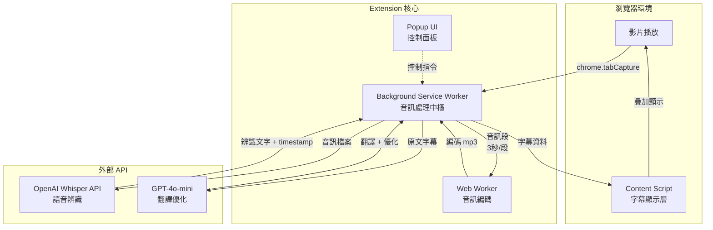

# 📘 Babel Bridge (巴別之橋)
> 打破語言與聽覺的障礙,讓每個人都能輕鬆理解網路影片內容

---

## 🧭 專案簡介 (Overview)

Babel Bridge 是一個免費的 Chrome 瀏覽器擴充功能,專為聾啞人士、外語學習者與需要字幕的觀眾設計。透過 AI 語音辨識技術,將任何網路影片的音訊即時轉換為準確的字幕,並支援多語言翻譯。就像巴別塔的反面——我們不製造語言障礙,而是消除它們。

本專案採用 Chrome 原生 API 直接擷取影片音訊流,搭配 OpenAI Whisper 進行高準確度語音辨識,延遲僅 4-5 秒,為使用者提供流暢的觀影體驗。

---

## 🚀 功能摘要 (Key Features)

- ✅ **即時語音辨識**: 使用 OpenAI Whisper API,準確度高達 90%+,支援 90+ 語言
- 🎯 **智慧斷句處理**: Rolling Window 技術配合 AI 語義分析,避免句子被不當切斷
- 🌍 **多語言翻譯**: 整合 GPT-4o-mini,將字幕即時翻譯成目標語言
- 🎨 **雙層字幕顯示**: 同時顯示原文與翻譯,可自訂樣式、大小、位置
- 🔒 **隱私優先**: 音訊處理僅在必要時傳送至 API,不做任何儲存
- 🆓 **完全免費**: 開源專案,使用者僅需自備 OpenAI API Key

---

## 🏗️ 系統架構 (Architecture)



**架構說明:**
- **Background Service Worker**: 核心控制器,管理音訊擷取、切段、API 呼叫與字幕分發
- **Web Worker**: 處理音訊編碼工作,避免阻塞主執行緒
- **Content Script**: 注入目標網頁,負責字幕 UI 渲染與影片同步
- **Popup UI**: 提供開關控制、語言選擇、API Key 設定等功能

---

## 🧰 技術棧 (Tech Stack)

| 類別 | 技術 | 備註 |
|------|------|------|
| 核心框架 | Chrome Extension (Manifest V3) | 使用最新標準 |
| 程式語言 | JavaScript / TypeScript | 優先考慮 TypeScript 提升可維護性 |
| 音訊處理 | Web Audio API, MediaStream API | chrome.tabCapture 擷取音訊流 |
| 語音辨識 | OpenAI Whisper API | 高準確度,支援 90+ 語言 |
| 翻譯引擎 | OpenAI GPT-4o-mini | 智慧翻譯與斷句優化 |
| UI 框架 | 原生 DOM / 輕量級框架 | Content Script 需避免衝突 |
| 音訊編碼 | lamejs (MP3 Encoder) | Web Worker 中進行編碼 |
| 儲存 | chrome.storage.local | 保存用戶設定與 API Key |
| 開發工具 | Vite / Webpack | 打包與熱重載 |
| 測試框架 | Jest / Playwright | 單元測試與 E2E 測試 |

---

## ⚙️ 專案結構 (Project Structure)

```bash
babel-bridge/
├── src/
│   ├── background/
│   │   ├── service-worker.js        # 主控制器
│   │   ├── audio-capture.js         # 音訊擷取邏輯
│   │   ├── audio-chunker.js         # Rolling Window 切段
│   │   ├── whisper-client.js        # Whisper API 封裝
│   │   ├── translator.js            # GPT 翻譯邏輯
│   │   └── subtitle-processor.js    # 字幕處理與合併
│   ├── content/
│   │   ├── injector.js              # 注入入口
│   │   ├── subtitle-overlay.js      # 字幕顯示元件
│   │   ├── video-detector.js        # 影片元素偵測
│   │   └── styles.css               # 字幕樣式
│   ├── popup/
│   │   ├── popup.html               # 控制面板 UI
│   │   ├── popup.js                 # 面板邏輯
│   │   └── popup.css                # 面板樣式
│   ├── workers/
│   │   └── audio-encoder.worker.js  # 音訊編碼 Worker
│   ├── lib/
│   │   ├── overlap-detector.js      # 重疊區比對
│   │   └── storage-manager.js       # 設定管理
│   └── manifest.json                # Extension 配置
├── tests/
│   ├── unit/                        # 單元測試
│   └── e2e/                         # 端對端測試
├── docs/
│   ├── PRD.md                       # 產品需求文件
│   ├── SPEC.md                      # 系統規格文件
│   └── API.md                       # API 使用說明
├── .env.example                     # 環境變數範例
├── package.json
└── README.md                        # 本檔案
```

---

## 🧑‍💻 安裝與使用 (Installation & Usage)

### 開發環境設定

```bash
# 1️⃣ 複製專案
git clone https://github.com/yourusername/babel-bridge.git
cd babel-bridge

# 2️⃣ 安裝依賴
npm install

# 3️⃣ 建立環境變數
cp .env.example .env
# 編輯 .env 並填入你的 OpenAI API Key

# 4️⃣ 啟動開發模式
npm run dev
```

### 載入到 Chrome

1. 開啟 Chrome 並前往 `chrome://extensions/`
2. 開啟右上角的「開發人員模式」
3. 點擊「載入未封裝項目」
4. 選擇專案的 `dist/` 資料夾
5. Extension 已成功載入!

### 使用方式

#### 首次設定
1. 安裝 Extension 後,點擊瀏覽器工具列的 Babel Bridge 圖示
2. 在 Popup 中點擊「設定 API Key」
3. 前往 [OpenAI Platform](https://platform.openai.com/api-keys) 取得你的 API Key
4. 將 API Key 貼入設定欄位並儲存
5. 系統會自動驗證 API Key 是否有效

**重要提醒**:
- 🔑 你需要有 OpenAI 帳號並自備 API Key
- 💰 使用成本約 **$0.37/小時影片**(非常便宜!)
- 🔒 API Key 安全儲存在本地,不會上傳到任何伺服器
- 💳 OpenAI 提供新帳號免費額度,足夠測試使用

#### 日常使用
1. 前往任何包含影片的網站 (YouTube, Vimeo 等)
2. 點擊瀏覽器工具列的 Babel Bridge 圖示
3. 點擊「啟用字幕」按鈕
4. 允許音訊擷取權限
5. 字幕將自動出現在影片上!

---

## 🧪 測試 (Testing)

```bash
# 執行單元測試
npm run test

# 執行端對端測試
npm run test:e2e

# 測試覆蓋率報告
npm run test:coverage
```

**測試策略**: 
- **單元測試**: 驗證音訊處理、API 呼叫、字幕合併等核心邏輯
- **整合測試**: 驗證 Background 與 Content Script 通訊
- **E2E 測試**: 使用 Playwright 模擬真實使用場景

---

## 📦 打包與發布 (Build & Release)

```bash
# 打包生產版本
npm run build

# 產生 .zip 檔案用於 Chrome Web Store 上架
npm run package
```

打包完成後,`dist/` 資料夾包含可上架的檔案。

---

## 🔑 權限說明 (Permissions)

本 Extension 需要以下權限:

| 權限 | 用途 | 說明 |
|------|------|------|
| `tabCapture` | 擷取影片音訊 | 直接從 tab 擷取音訊流,不使用麥克風 |
| `activeTab` | 存取當前頁面 | 注入字幕顯示 UI |
| `storage` | 儲存設定 | 保存 API Key 與用戶偏好 |
| `scripting` | 注入腳本 | 動態注入 Content Script |
| `host_permissions` | 存取網頁 | 支援所有網站的影片 |

**隱私保證**: 我們不收集、儲存或傳輸任何個人資料。音訊僅在必要時傳送至 OpenAI API 進行處理。

---

## 📅 開發里程碑 (Milestones)

### Phase 1: 基礎辨識 (2 週)
- ✅ chrome.tabCapture 音訊擷取
- ✅ Rolling Window 音訊切段 (3 秒/段,重疊 1 秒)
- ✅ Web Worker 音訊編碼
- ✅ Whisper API 整合
- ✅ 基本 console 輸出驗證

**驗收標準**: 能在 console 看到即時辨識的文字結果

### Phase 2: 字幕顯示 (2 週)
- ✅ Content Script 注入機制
- ✅ 字幕 Overlay UI 設計
- ✅ 雙層字幕容器
- ✅ 字幕樣式自訂 (大小、顏色、位置、透明度)
- ✅ 與影片播放狀態同步 (暫停、播放、快轉)
- ✅ Popup UI 控制面板

**驗收標準**: 字幕正確顯示在影片上,並能調整樣式

### Phase 3: 翻譯功能 (2 週)
- ✅ GPT-4o-mini 翻譯整合
- ✅ 斷句優化邏輯
- ✅ 雙層字幕顯示 (原文 + 翻譯)
- ✅ 語言選擇介面
- ✅ 翻譯快取優化
- ✅ 效能調整與記憶體管理

**驗收標準**: 能同時顯示原文與翻譯字幕,延遲 < 8 秒

---

## 🧩 相關文件 (Documentation)

| 文件 | 說明 |
|------|------|
| [`README.md`](./README.md) | 專案總覽與技術架構 (本檔) |
| [`PRD.md`](./docs/PRD.md) | 產品需求與使用者故事 |
| [`SPEC.md`](./docs/SPEC.md) | 系統規格與 API 契約 |
| [`API.md`](./docs/API.md) | OpenAI API 使用指南 |

---

## 🤝 貢獻指南 (Contributing)

歡迎任何形式的貢獻!無論是回報 Bug、提出功能建議,或是直接提交程式碼。

1. Fork 此專案
2. 建立功能分支: `git checkout -b feature/amazing-feature`
3. 提交修改: `git commit -m "feat: add amazing feature"`
4. 推送分支: `git push origin feature/amazing-feature`
5. 發起 Pull Request

**Commit 規範**: 遵循 [Conventional Commits](https://www.conventionalcommits.org/)
- `feat`: 新功能
- `fix`: Bug 修復
- `docs`: 文件更新
- `style`: 程式碼格式調整
- `refactor`: 重構
- `test`: 測試相關
- `chore`: 其他雜項

---

## 📜 授權 (License)

MIT License © 2025 Babel Bridge Contributors

本專案採用 MIT 授權,允許任何人自由使用、修改與分發。

---

## 🙏 致謝 (Acknowledgments)

- **OpenAI**: 提供強大的 Whisper 與 GPT API
- **聾啞社群**: 給予專案靈感與回饋
- **開源貢獻者**: 讓這個專案更加完善

---

## 🧭 聯絡與支援

- **Issue Tracker**: [GitHub Issues](https://github.com/yourusername/babel-bridge/issues)
- **Discussions**: [GitHub Discussions](https://github.com/yourusername/babel-bridge/discussions)
- **Email**: support@babelbridge.dev

---

## 🌟 專案願景

我們的目標是建立一個完全無障礙的網路影片體驗。就像聖經中的巴別塔故事,語言曾經分隔了人類;但今天,我們要用技術搭建一座橋樑,讓每個人——無論聽力狀態、母語為何——都能平等地享受網路內容。

**讓我們一起打破障礙,連結世界。**
