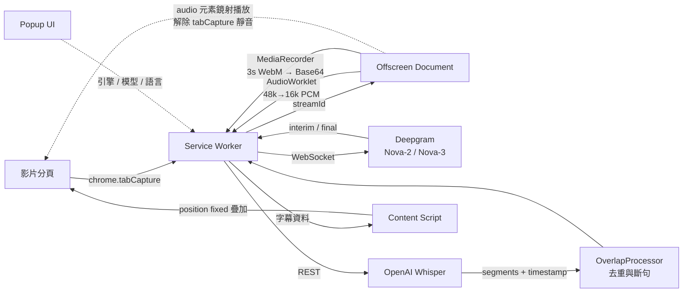

# Babel Bridge 巴別之橋

[](https://opensource.org/licenses/MIT)
[](https://developer.chrome.com/docs/extensions/mv3/intro/)
[](https://developer.mozilla.org/docs/Web/JavaScript)

[English](README_EN.md)

替任何網頁影片產生即時字幕的 Chrome 擴充功能。自備 API Key，音訊不留存。

> 巴別塔的故事裡，語言把人分開。這個專案想做的是反過來那件事。

## 核心概念

網路上大部分影片沒有字幕，有字幕的也未必是你看得懂的語言。聽障者、外語學習者、在吵雜環境看影片的人，都卡在同一個地方。

Babel Bridge 用 `chrome.tabCapture` 直接擷取分頁的音訊流，送進語音辨識 API，再把結果疊回影片上。不需要下載影片，不需要上傳檔案，不挑網站。

架構上有兩條管線，因為「即時」和「準確」在雲端 API 上是換不來的：

| 引擎 | 走的路 | 適合 |
|------|--------|------|
| **Deepgram Streaming** | WebSocket 持續串流，邊說邊出字 | 直播、會議、對話 |
| **OpenAI Whisper** | 3 秒切段批次辨識，事後對齊時間軸 | 預錄影片、要求高準確度 |

兩條都保留，在 Popup 切換。

## 功能特色

| 功能 | 說明 |
|------|------|
| **雙引擎切換** | Deepgram 即時串流與 Whisper 批次辨識並存，依場景選 |
| **模型與語言選擇** | Nova-2 / Nova-3，12 種語言，Nova-3 支援 `multi` 自動偵測 |
| **智慧去重與斷句** | `OverlapProcessor` 處理重疊區重複辨識，雙重策略比對，過濾率 15-25% |
| **時間軸對齊** | 查詢 `video.currentTime` 往回推算，暫停不會累積誤差 |
| **API Key 加密儲存** | AES-256-GCM + PBKDF2-SHA256（100k 迭代），金鑰由瀏覽器指紋衍生 |
| **自帶金鑰** | 沒有中間伺服器，你的音訊只會送到你自己的 API 帳號 |

## 系統架構


```mermaid
flowchart LR
    Video[影片分頁] -->|chrome.tabCapture| SW[Service Worker]
    SW -->|streamId| OFF[Offscreen Document]

    OFF -->|AudioWorklet<br/>48k→16k PCM| SW
    OFF -->|MediaRecorder<br/>3s WebM → Base64| SW
    OFF -.->|audio 元素鏡射播放<br/>解除 tabCapture 靜音| Video

    SW -->|WebSocket| DG[Deepgram<br/>Nova-2 / Nova-3]
    SW -->|REST| WH[OpenAI Whisper]

    DG -->|interim / final| SW
    WH -->|segments + timestamp| OP[OverlapProcessor<br/>去重與斷句]
    OP --> SW

    SW -->|字幕資料| CS[Content Script]
    CS -->|position fixed 疊加| Video
    POP[Popup UI] -.->|引擎 / 模型 / 語言| SW
```

兩條管線共用同一組 Offscreen Document 與 Content Script，差別在中間的音訊格式與 API 呼叫方式：

| 元件 | Deepgram 路徑 | Whisper 路徑 |
|------|--------------|-------------|
| Offscreen 產出 | AudioWorklet Int16 PCM（20ms frames） | MediaRecorder WebM（3s timeslice） |
| 跨 context 傳輸 | PCM frames | Base64 字串 |
| API | WebSocket 持續連線 | REST 逐段上傳 |
| 後處理 | interim / final 覆寫 | OverlapProcessor 去重 |

## 技術棧

| 技術 | 用途 | 備註 |
|------|------|------|
| Chrome Extension MV3 | 執行環境 | Service Worker + Offscreen Document |
| JavaScript ES6+ | 實作語言 | 無 runtime 依賴，打包後是純瀏覽器 JS |
| Deepgram Nova-2 / Nova-3 | 即時語音辨識 | WebSocket Streaming |
| OpenAI Whisper | 批次語音辨識 | `verbose_json` 取 segment 時間戳 |
| AudioWorklet | 音訊降採樣 | 48kHz → 16kHz，在獨立執行緒跑 |
| MediaRecorder | 音訊切片 | 取代 ScriptProcessorNode（見〈設計抉擇〉） |
| Web Crypto API | 金鑰加密 | AES-256-GCM + PBKDF2-SHA256 |
| Vite | 建置 | MV3 多入口打包 |
| Vitest | 測試 | 單元 + 整合；E2E（Playwright）尚未實作 |

## 快速開始

### 環境需求

- Node.js ≥ 18、npm ≥ 9
- Chrome（支援 Manifest V3）
- Deepgram 或 OpenAI 其中一組 API Key

### 安裝

```bash
git clone https://github.com/tznthou/Babel_Bridge.git
cd Babel_Bridge

npm install
npm run build      # 產出到 dist/
```

開發時用 `npm run dev`，會 watch 檔案變動持續重建。

### 載入 Chrome

1. 開 `chrome://extensions/`
2. 右上角開啟「開發人員模式」
3. 點「載入未封裝項目」，選 `dist/` 資料夾

尚未上架 Chrome Web Store，目前只能用開發者模式載入。

### 設定 API Key

API Key 直接在 Popup 介面輸入，會經過 AES-256-GCM 加密後存進 `chrome.storage.local`。**不需要 `.env` 檔，也不要把金鑰寫進任何原始碼。**

**Deepgram**（低延遲路徑）：到 [Deepgram Console](https://console.deepgram.com/) 建 API Key，選 Default 角色（需要 `usage:write` 權限），貼進 Popup 的 Deepgram 頁籤，再選模型與語言。

**OpenAI**（高準確路徑）：到 [OpenAI Platform](https://platform.openai.com/api-keys) 取得 Key，貼進 OpenAI 頁籤，系統會呼叫 `/v1/models` 驗證有效性。支援 `sk-`、`sk-proj-`、`sk-admin-`、`sk-org-` 四種格式。

### 成本

| 引擎 | 單價 | 一小時影片 |
|------|------|-----------|
| Deepgram Nova-2 | $0.0043 / 分鐘 | 約 $0.26 |
| Deepgram Nova-3 | $0.0077 / 分鐘 | 約 $0.46 |
| OpenAI Whisper | $0.006 / 分鐘 | 約 $0.36 |

費用直接算在你自己的 API 帳號上，這個專案不經手任何金流。

### 使用

開任何有影片的網頁 → 點工具列的 Babel Bridge 圖示 → 選引擎 → 啟用字幕 → 允許音訊擷取。

## 技術限制

這些是實測撞到的牆，不是還沒做完的功能：

| 限制 | 說明 |
|------|------|
| **中英夾雜內容無解** | Deepgram 選 `zh-TW` 時英文會變亂碼，選 `multi` 自動偵測則中文完全消失（`multi` 不支援中文與韓文） |
| **Nova-3 不支援中文** | `zh-TW` / `zh` 會回 HTTP 400，中文只能用 Nova-2 |
| **Whisper 路徑延遲 5-7 秒** | MediaRecorder 累積 3s + API 處理 2-3s + 網路 0.5-1s，是雲端架構的下限 |
| **Deepgram 延遲數字待驗證** | Phase 2.3 觀察到約 2-3 秒，但當時沒有分開量「首字上畫面」與「字幕定版」兩個時間點，這兩者差距可能很大。數字待重測 |
| **需要開發者模式** | 尚未上架 Chrome Web Store |

## 專案結構

```
Babel Bridge/
├── src/
│   ├── background/         Service Worker 主控制器、Deepgram WebSocket 客戶端、
│   │                       Whisper 客戶端、OverlapProcessor
│   ├── offscreen/          音訊擷取、AudioWorklet PCM 處理、鏡射播放
│   ├── content/            字幕疊加層與影片時間監聽
│   ├── popup/              控制面板（雙 API Key、模型與語言選擇）
│   └── lib/                加密工具、金鑰管理、錯誤處理、斷句規則、相似度計算
├── tests/                  unit（Vitest）· integration（需 API Key）· e2e（待實作）
├── docs/                   PRD · SPEC · DEVELOPMENT · MILESTONES · testing/ · archive/
├── scripts/                建置腳本 + debug/（DevTools Console 診斷工具）
├── demo/                   OverlapProcessor 互動示範頁
├── README.md               本檔
└── README_EN.md            English version
```

## 開發狀態

Phase 2 完成，目前是雙引擎可用狀態。各階段的實作細節、測試數據與 commit 記錄整理在 [docs/MILESTONES.md](docs/MILESTONES.md)。

| Phase | 期間 | 狀態 |
|-------|------|------|
| Phase 0 基礎建置與安全機制 | 2025-11-08 | ✅ |
| Phase 1 Whisper 管線與字幕顯示 | 2025-11-09 ~ 11-15 | ✅ |
| Phase 2 Deepgram Streaming | 2025-11-16 ~ 12-02 | ✅ |
| Phase 3 UI 優化與翻譯功能 | — | 🔲 |

```bash
npm test                 # 單元 + 整合測試（缺 API Key 時整合測試自動跳過）
npm run test:unit        # 只跑單元測試
npm run test:integration # 需要 DEEPGRAM_API_KEY 環境變數
npm run lint
npm run typecheck        # JSDoc 型別檢查（checkJs，非 TypeScript 遷移）
npm run package          # 產生上架用 .zip
```

## 隨想

### 設計抉擇

**為什麼砍掉 ScriptProcessorNode**

最初的音訊管線是 `AudioContext` + `ScriptProcessorNode` + MP3 編碼。它會讓整個瀏覽器凍結——不是分頁沒回應，是整個 Chrome 卡死。

追了兩天才知道問題不在我的程式碼：`ScriptProcessorNode` 早就 deprecated，它在 Offscreen Document 裡跟 `tabCapture` 組合會觸發 Chrome 底層的死鎖。這種 bug 不可能靠加 log、調參數修好，因為錯的是「用這個 API」這個決定本身。

最後整條管線改用 `MediaRecorder`。順帶好處是不用自己編 MP3 了——WebM 格式 Whisper 直接吃，還少一個 LGPL 依賴。

從此我在這個專案養成一個習慣：遇到系統級的凍結或死鎖，先問「這個 API 是不是已經被標記過時」，而不是先問「我哪一行寫錯」。

**為什麼音訊要轉成 Base64 才能傳**

Manifest V3 的 Service Worker 跟 Offscreen Document 之間只能用 `chrome.runtime.sendMessage` 溝通，而它的 structured clone 對 `Blob` 支援不完整——傳過去會失真，而且不會報錯，只是靜靜地壞掉。

所以現在是 `Blob → ArrayBuffer → Base64` 傳過去，另一邊再重建回 `Blob`。多繞一圈很醜，但這是 MV3 的現實。

**為什麼留著兩個引擎**

一開始只有 Whisper。做完才發現 5-7 秒延遲是雲端批次架構的物理下限：3 秒切片 + 2-3 秒 API + 網路。這對「看預錄影片配字幕」夠用，對直播完全不行。

Deepgram 的串流才是即時場景的正解。但 Whisper 的準確度和 `OverlapProcessor` 的去重能力在批次場景仍然更好，所以沒有砍掉，變成兩條管線並存。

### 學到什麼

**「測試綠了」不等於「測試有效」**

重連機制的測試曾經是綠的。後來才發現它只把假時鐘推進 100 毫秒，而重連延遲設定是 1000 毫秒——把整個 `connect()` 刪掉，那個測試照樣通過。

它測的是「呼叫不會爆炸」，不是「重連真的發生」。現在修測試時我會多問一句：把production code 弄壞，這條會紅嗎？

**接上一個沒接的功能，可能讓既有缺陷變嚴重**

`startKeepAlive()` 寫好了但從來沒被呼叫。接上去之後才發現，原本那些會洩漏的 WebSocket 連線，本來是靠 Deepgram 的 10 秒逾時自己斷掉的——現在被 KeepAlive「續命」成永久連線，還會持續燒配額。

修好一個 bug 讓另一批 bug 從「無害」變成「要命」。這種連鎖不會寫在任何文件裡。

## 相關文件

| 文件 | 內容 |
|------|------|
| [docs/DEVELOPMENT.md](docs/DEVELOPMENT.md) | **現行架構**、設計決策、除錯指南 |
| [docs/MILESTONES.md](docs/MILESTONES.md) | 各階段實作細節、測試數據、已知問題 |
| [CHANGELOG.md](CHANGELOG.md) | 變更記錄 |
| [docs/testing/](docs/testing/) | 測試指南 |
| [CLAUDE.md](CLAUDE.md) | AI 協作開發指引 |
| [docs/SPEC.md](docs/SPEC.md) | ⚠️ 早期系統規格稿，架構已於 Phase 1/2 變更，僅供追溯設計意圖 |
| [docs/PRD.md](docs/PRD.md) | ⚠️ 早期產品需求稿，未涵蓋雙引擎架構 |
| [docs/archive/](docs/archive/) | 開發記錄封存（保留當時原貌） |

## 貢獻

歡迎回報問題與提交 PR。[開 issue](https://github.com/tznthou/Babel_Bridge/issues) 前請附上瀏覽器版本、目標網站與 Console 輸出。

Commit 遵循 [Conventional Commits](https://www.conventionalcommits.org/)：`feat` / `fix` / `docs` / `test` / `refactor` / `chore`。

## 致謝

實作過程參考了這些專案的做法：

| 專案 | 授權 | 參考了什麼 |
|------|------|-----------|
| [videospeed](https://github.com/igrigorik/videospeed) | MIT | 影片元素定位邏輯 |
| [youtube.external.subtitle](https://github.com/siloor/youtube.external.subtitle) | MIT | 全螢幕模式處理 |
| [JavascriptSubtitlesOctopus](https://github.com/libass/JavascriptSubtitlesOctopus) | MIT | 字幕 timeOffset 機制 |
| [netflix_subtitles_adder](https://github.com/chamika1/netflix_subtitles_adder) | MIT | `video.currentTime` 同步 |
| [MediaElement.js](https://github.com/mediaelement/mediaelement) | MIT | HTML5 媒體事件處理 |
| [WhisperJAV](https://github.com/meizhong986/WhisperJAV) | MIT | 字幕去重邏輯 |
| [tokenx](https://github.com/johannschopplich/tokenx) | MIT | 文字分塊與 overlap 策略 |
| [Natural](https://github.com/NaturalNode/natural) | MIT | Levenshtein Distance 實作 |
| [DashPlayer](https://github.com/solidSpoon/DashPlayer) | AGPL-3.0 | 僅參考架構概念，未使用程式碼 |

## 授權

[MIT](LICENSE)

## 作者

[@tznthou](https://github.com/tznthou)
