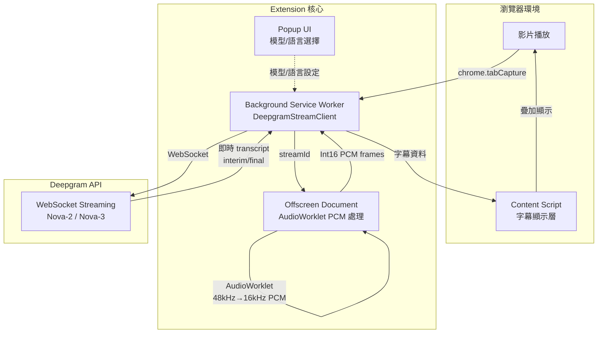
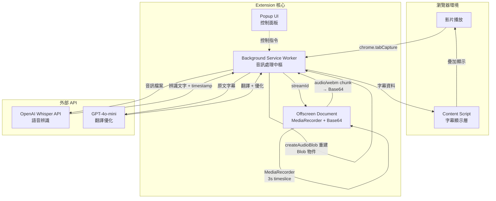

# 📘 Babel Bridge (巴別之橋)
> 打破語言與聽覺的障礙,讓每個人都能輕鬆理解網路影片內容

---

## 🧭 專案簡介 (Overview)

Babel Bridge 是一個免費的 Chrome 瀏覽器擴充功能,專為聾啞人士、外語學習者與需要字幕的觀眾設計。透過 AI 語音辨識技術,將任何網路影片的音訊即時轉換為準確的字幕,並支援多語言翻譯。就像巴別塔的反面——我們不製造語言障礙,而是消除它們。

**雙引擎架構** — 根據需求選擇最適合的語音辨識引擎：

| 引擎 | 延遲 | 準確度 | 適用場景 |
|------|------|--------|----------|
| **Deepgram Streaming** | 2-3 秒 | 高 | 即時對話、直播、會議 |
| **OpenAI Whisper** | 5-7 秒 | 極高 | 預錄影片、高品質字幕 |

本專案採用 Chrome 原生 API 直接擷取影片音訊流，支援 Deepgram Nova-2/Nova-3 即時串流與 OpenAI Whisper 批次辨識，為使用者提供流暢的觀影體驗。

---

## 🚀 功能摘要 (Key Features)

- ⚡ **雙引擎架構**: Deepgram 即時串流（2-3s 延遲）+ Whisper 高準確辨識（5-7s 延遲）
- 🎙️ **Deepgram Streaming**: Nova-2/Nova-3 模型，WebSocket 即時串流，支援 12 種語言 + 自動偵測
- ✅ **Whisper 高準確辨識**: OpenAI Whisper API，準確度 90%+，支援 90+ 語言
- 🎯 **智慧斷句處理**: Rolling Window 技術配合 AI 語義分析，避免句子被不當切斷
- 🌍 **多語言翻譯**: 整合 GPT-4o-mini，將字幕即時翻譯成目標語言（開發中）
- 🎨 **雙層字幕顯示**: 同時顯示原文與翻譯，可自訂樣式、大小、位置
- 🔒 **隱私與安全**:
  - 音訊處理僅在必要時傳送至 API，不做任何儲存
  - **API Key 加密保護**: 使用 AES-256-GCM 軍事級加密儲存
  - 瀏覽器指紋衍生金鑰，防止跨裝置竊取
  - 安全評分: 96/100 (符合 OWASP 2023 標準)
- 🆓 **完全免費**: 開源專案，使用者僅需自備 API Key（OpenAI 或 Deepgram）

---

## 🏗️ 系統架構 (Architecture)

### Deepgram Streaming 架構（即時串流，延遲 2-3 秒）


```mermaid
flowchart TB
    subgraph Browser["瀏覽器環境"]
        Video[影片播放]
        ContentScript[Content Script<br/>字幕顯示層]
    end

    subgraph Extension["Extension 核心"]
        Background[Background Service Worker<br/>DeepgramStreamClient]
        Offscreen[Offscreen Document<br/>AudioWorklet PCM 處理]
        Popup[Popup UI<br/>模型/語言選擇]
    end

    subgraph Deepgram["Deepgram API"]
        WebSocket[WebSocket Streaming<br/>Nova-2 / Nova-3]
    end

    Video -->|chrome.tabCapture| Background
    Background -->|streamId| Offscreen
    Offscreen -->|getUserMedia| Offscreen
    Offscreen -->|AudioWorklet<br/>48kHz→16kHz PCM| Offscreen
    Offscreen -->|Int16 PCM frames| Background
    Background -->|WebSocket| WebSocket
    WebSocket -->|即時 transcript<br/>interim/final| Background
    Background -->|字幕資料| ContentScript
    ContentScript -->|疊加顯示| Video
    Popup -.->|模型/語言設定| Background
```

### Whisper 批次架構（高準確度，延遲 5-7 秒）


```mermaid
flowchart TB
    subgraph Browser["瀏覽器環境"]
        Video[影片播放]
        ContentScript[Content Script<br/>字幕顯示層]
    end

    subgraph Extension["Extension 核心"]
        Background[Background Service Worker<br/>音訊處理中樞]
        Offscreen[Offscreen Document<br/>MediaRecorder + Base64]
        Popup[Popup UI<br/>控制面板]
    end

    subgraph APIs["外部 API"]
        Whisper[OpenAI Whisper API<br/>語音辨識]
        GPT[GPT-4o-mini<br/>翻譯優化]
    end

    Video -->|chrome.tabCapture| Background
    Background -->|streamId| Offscreen
    Offscreen -->|getUserMedia| Offscreen
    Offscreen -->|MediaRecorder<br/>3s timeslice| Offscreen
    Offscreen -->|audio/webm chunk<br/>→ Base64| Background
    Background -->|createAudioBlob 重建<br/>Blob 物件| Background
    Background -->|音訊檔案| Whisper
    Whisper -->|辨識文字 + timestamp| Background
    Background -->|原文字幕| GPT
    GPT -->|翻譯 + 優化| Background
    Background -->|字幕資料| ContentScript
    ContentScript -->|疊加顯示| Video
    Popup -.->|控制指令| Background
```

**架構說明:**

| 元件 | Deepgram Streaming | Whisper 批次 |
|------|-------------------|--------------|
| **Background** | DeepgramStreamClient + WebSocket | WhisperClient + REST API |
| **Offscreen** | AudioWorklet PCM (16kHz) | MediaRecorder WebM (3s) |
| **音訊傳輸** | Int16 PCM frames | Base64 encoded WebM |
| **延遲** | 2-3 秒 | 5-7 秒 |

- **Background Service Worker**: 核心控制器，管理音訊擷取、API 呼叫與字幕分發
- **Offscreen Document**: Deepgram 用 AudioWorklet 產生 PCM；Whisper 用 MediaRecorder 產生 WebM
- **Content Script**: 注入目標網頁，負責字幕 UI 渲染與影片時間同步
- **Popup UI**: 提供 API Key 設定、模型選擇（Nova-2/Nova-3）、語言選擇（12 種 + 自動偵測）

---

## 🎯 字幕定位技術 (Subtitle Positioning)

### 動態定位策略

Babel Bridge 使用動態計算方式精確對齊影片播放器，確保字幕顯示在正確位置。

**核心實作**：
- `ResizeObserver` 監聽影片尺寸變化
- `getBoundingClientRect()` 動態計算影片位置
- 支援全螢幕模式（fullscreen/webkitfullscreen/mozfullscreen）
- 適用於所有影片網站（YouTube、Netflix、Vimeo 等）

**參考專案**：
- [igrigorik/videospeed](https://github.com/igrigorik/videospeed) - MIT License（定位邏輯參考）
- [siloor/youtube.external.subtitle](https://github.com/siloor/youtube.external.subtitle) - MIT License（全螢幕處理參考）

**技術選擇**：
- `position: fixed` + 動態座標（而非 absolute + 注入容器）
- 優勢：低風險、高相容性、不受網站 CSS 影響
- 自動適應：影片 resize、theater mode、fullscreen

**實作細節**：
```javascript
// SubtitleOverlay.updatePosition()
const rect = video.getBoundingClientRect();
this.container.style.left = `${rect.left}px`;
this.container.style.top = `${rect.top}px`;
this.container.style.width = `${rect.width}px`;
this.container.style.height = `${rect.height}px`;
```

詳見 [src/content/content-script.js](src/content/content-script.js) 的 `SubtitleOverlay.setupPositioning()`

---

## ⏱️ 時間同步技術 (Time Synchronization)

### 動態時間查詢策略 ✅ (2025-11-15 完成)

Babel Bridge 需要將音訊擷取時間與影片播放時間精確對應，確保字幕在正確時刻顯示。

**核心挑戰**：
- 音訊處理延遲（MediaRecorder 累積 + Whisper API 處理）：5-7 秒
- Whisper 返回的時間戳是相對於音訊片段開始的相對時間
- 需要轉換為影片播放時間軸的絕對時間
- **暫停累積問題**：舊方案使用累積計算，暫停時產生 25-35 秒誤差

**解決方案：動態時間查詢**

在 Whisper 辨識完成後，立即查詢實際 `video.currentTime`，往回推算音訊對應的影片時間。

1. **Service Worker 查詢影片時間**：
   ```javascript
   // 透過 chrome.tabs.sendMessage 查詢 Content Script
   const currentVideoTime = await chrome.tabs.sendMessage(
     tabId,
     { type: 'GET_VIDEO_CURRENT_TIME' }
   );
   ```

2. **往回推算音訊開始時間**：
   ```javascript
   const audioDuration = audioEndTime - audioStartTime;
   const correctedVideoStartTime = currentVideoTime - audioDuration;
   ```

3. **OverlapProcessor 調整時間戳**：
   ```javascript
   segment.start = correctedVideoStartTime + whisperSegment.start;
   segment.end = correctedVideoStartTime + whisperSegment.end;
   ```

4. **VideoMonitor 動態匹配**：根據 `video.currentTime` 查找對應 segment

**測試結果** (2025-11-15)：
- 測試影片：2 分鐘短片，完整播放不暫停
- 處理 chunks：36 個，成功率 100%
- **timeDiff 穩定範圍**：0.7-2.5 秒（主要來自 Whisper 處理延遲）
- ✅ 無時間累積問題（暫停不會產生誤差）
- ✅ 字幕連續產生，無中斷

**物理延遲極限分析**：
```
MediaRecorder 累積:  3 秒
Whisper API 處理:   2-3 秒
網路傳輸:           0.5-1 秒
──────────────────────────
總延遲:            5.5-7 秒（雲端架構物理極限）
```

**結論**：5-7 秒是雲端 Whisper 架構的**最優解**，無法再優化。未來若需更低延遲，需改用本地 Whisper 模型（transformers.js），可達 2-3 秒。

**參考專案**：
- [libass/JavascriptSubtitlesOctopus](https://github.com/libass/JavascriptSubtitlesOctopus) - MIT License（timeOffset 機制）
- [chamika1/netflix_subtitles_adder](https://github.com/chamika1/netflix_subtitles_adder) - MIT License（video.currentTime 同步）
- [mediaelement/mediaelement](https://github.com/mediaelement/mediaelement) - MIT License（seeked 事件處理）

**實作細節**：詳見 [src/background/service-worker.js](src/background/service-worker.js) 的 `getCurrentVideoTime()` 與 `processChunk()` 方法

---

## 🧰 技術棧 (Tech Stack)

| 類別 | 技術 | 備註 |
|------|------|------|
| 核心框架 | Chrome Extension (Manifest V3) | 使用最新標準 |
| 程式語言 | JavaScript (ES6+) | 模組化設計，完整 JSDoc 註解 |
| **即時串流** | **Deepgram Nova-2/Nova-3** | **WebSocket Streaming，延遲 2-3 秒** |
| **音訊處理 (Deepgram)** | **AudioWorklet API** | **48kHz→16kHz PCM 即時轉換** |
| 音訊處理 (Whisper) | MediaRecorder API | 3 秒 timeslice 產生 WebM chunk |
| 語音辨識 (Whisper) | OpenAI Whisper API | 高準確度，支援 90+ 語言 |
| 翻譯引擎 | OpenAI GPT-4o-mini | 智慧翻譯與斷句優化（開發中） |
| **安全加密** | **Web Crypto API** | **AES-256-GCM + PBKDF2 (100k 迭代)** |
| UI 框架 | 原生 DOM / 輕量級框架 | Content Script 需避免衝突 |
| 跨 Context 傳輸 | Base64 / Int16 Array | Deepgram 用 PCM，Whisper 用 Base64 |
| 儲存 | chrome.storage.local | 加密儲存 API Key 與用戶設定 |
| 建置工具 | Vite | 現代化打包與開發體驗 |
| 測試框架 | Vitest / Playwright | 單元與整合測試已建立，E2E 待實作 |

---

## ⚙️ 專案結構 (Project Structure)

```bash
Babel Bridge/
├── src/
│   ├── background/                  # 📦 Background 服務
│   │   ├── service-worker.js        # ✅ 主控制器 (Deepgram/Whisper 管線編排)
│   │   ├── deepgram-stream-client.js # ✅ Deepgram WebSocket 串流客戶端
│   │   ├── audio-capture.js         # ✅ 音訊擷取 (chrome.tabCapture)
│   │   ├── whisper-client.js        # ✅ Whisper API 整合
│   │   └── subtitle-processor.js    # ✅ OverlapProcessor (核心去重與斷句)
│   ├── offscreen/                   # 📦 Offscreen Document
│   │   ├── offscreen.js             # ✅ 音訊處理 + 鏡射播放
│   │   └── pcm-processor.js         # ✅ AudioWorklet PCM 處理 (48kHz→16kHz)
│   ├── content/                     # 📦 Content Script
│   │   ├── content-script.js        # ✅ 字幕顯示 (VideoMonitor + SubtitleOverlay)
│   │   └── subtitle-overlay.css     # ✅ 字幕樣式
│   ├── popup/                       # 📦 Popup UI
│   │   ├── popup.html               # ✅ 控制面板 UI (含模型/語言選擇)
│   │   ├── popup.js                 # ✅ 面板邏輯 (雙 API Key 管理)
│   │   └── popup.css                # ✅ 面板樣式
│   └── lib/                         # 📦 核心函式庫
│       ├── errors.js                # ✅ 統一錯誤處理 (BabelBridgeError)
│       ├── error-handler.js         # ✅ 錯誤處理器
│       ├── config.js                # ✅ 全域配置 (含 DEEPGRAM_CONFIG)
│       ├── api-key-manager.js       # ✅ OpenAI API Key 管理
│       ├── deepgram-key-manager.js  # ✅ Deepgram API Key 管理
│       ├── crypto-utils.js          # ✅ 加密工具 (AES-GCM + PBKDF2)
│       ├── language-rules.js        # ✅ 多語言斷句規則
│       └── text-similarity.js       # ✅ Levenshtein Distance 相似度計算
├── tests/                           # 📦 測試
│   ├── unit/                        # ✅ 單元測試 (Vitest)
│   ├── integration/                 # ✅ 整合測試 (需 API Key，缺 key 自動跳過)
│   └── e2e/                         # 🔲 E2E 測試 (Playwright，待實作)
├── docs/                            # 📦 專案文件
│   ├── PRD.md                       # ✅ 產品需求文件
│   ├── SPEC.md                      # ✅ 系統規格文件
│   ├── DEVELOPMENT.md               # ✅ 開發環境與工作流程
│   ├── testing/                     # ✅ 測試指南
│   │   ├── TESTING_QUICKSTART.md    #    快速上手
│   │   └── TESTING_PHASE1.md        #    Phase 1 完整驗證
│   └── archive/                     # ✅ 開發記錄封存 (保留當時原貌)
│       ├── NewWay.md                #    MediaRecorder 管線遷移
│       ├── NewWay2.md               #    WebM Header 補強
│       ├── NewWay3.md               #    Deepgram 串流修復接手指南
│       └── ai-coding-realtime-spec-v3.md  # Streaming STT 規格草案
├── scripts/                         # 📦 建置與除錯腳本
│   ├── package.js                   # ✅ Chrome Web Store 打包
│   ├── fix-paths.js                 # ✅ 建置後路徑修正
│   └── debug/                       # ✅ DevTools Console 診斷工具
│       ├── diagnostic-script.js     #    字幕顯示管線診斷
│       └── test-message.js          #    訊息傳遞驗證
├── demo/                            # 📦 OverlapProcessor 互動示範頁
├── icons/                           # 📦 Extension 圖示
├── dist/                            # 建置輸出資料夾 (由 Vite 生成，不納入版控)
├── .serena/ · .claude/              # AI 工具本機資料 (不納入版控)
├── .gitignore                       # ✅ Git 忽略清單
├── manifest.json                    # ✅ Extension 配置 (Manifest V3)
├── package.json                     # ✅ 專案配置
├── vite.config.js                   # ✅ Vite 建置配置
├── vitest.config.js                 # ✅ Vitest 測試配置
├── CLAUDE.md                        # ✅ Claude Code 開發指引
├── README.md                        # 本檔案
└── LICENSE                          # ✅ MIT 授權
```

**圖例說明**:
- ✅ 已完成實作並測試
- 📦 核心模組目錄
- **Phase 0** (2025-11-08): API Key 加密管理系統
- **Phase 1** (2025-11-15): Whisper 音訊管線 + 字幕顯示
- **Phase 2** (2025-11-30): Deepgram Streaming + 模型語言選擇

---

## 🧑‍💻 安裝與使用 (Installation & Usage)

### 開發環境設定

```bash
# 1️⃣ 複製專案
git clone https://github.com/yourusername/babel-bridge.git
cd babel-bridge

# 2️⃣ 安裝依賴
npm install

# 3️⃣ 建立環境變數
cp .env.example .env
# 編輯 .env 並填入你的 OpenAI API Key

# 4️⃣ 啟動開發模式
npm run dev
```

### 載入到 Chrome

1. 開啟 Chrome 並前往 `chrome://extensions/`
2. 開啟右上角的「開發人員模式」
3. 點擊「載入未封裝項目」
4. 選擇專案的 `dist/` 資料夾
5. Extension 已成功載入!

### 使用方式

#### 首次設定 — 選擇你的語音辨識引擎

**選項 A：Deepgram Streaming（推薦，低延遲）**

1. 前往 [Deepgram Console](https://console.deepgram.com/) 註冊帳號
2. 建立 API Key（選擇 **Default** 角色，需要 `usage:write` 權限）
3. 在 Popup 的「Deepgram」頁籤中貼上 API Key
4. 選擇模型：
   - **Nova-2**（標準）：$0.0043/分鐘，需手動選擇語言
   - **Nova-3**（進階）：$0.0077/分鐘，支援自動語言偵測
5. 選擇語言（12 種可選，或 Nova-3 的「自動偵測」）

**選項 B：OpenAI Whisper（高準確度）**

1. 前往 [OpenAI Platform](https://platform.openai.com/api-keys) 取得 API Key
2. 在 Popup 的「OpenAI」頁籤中貼上 API Key
3. 系統會自動驗證 API Key 是否有效

**成本比較**：

| 引擎 | 成本 | 1 小時影片 |
|------|------|-----------|
| Deepgram Nova-2 | $0.0043/min | ~$0.26 |
| Deepgram Nova-3 | $0.0077/min | ~$0.46 |
| OpenAI Whisper | $0.006/min | ~$0.36 |

**重要提醒**:
- 🔒 **API Key 軍事級加密保護**:
  - 使用 AES-256-GCM 加密儲存在本地
  - PBKDF2-SHA256 金鑰衍生 (100,000 迭代)
  - 瀏覽器指紋綁定，防止跨裝置複製
  - 不會上傳到任何伺服器，完全本地加密
  - 安全評分: 96/100 (符合 OWASP 2023 標準)

**支援的 OpenAI API Key 格式**:
- ✅ Standard Key: `sk-[48字元]` (舊格式)
- ✅ Project Key: `sk-proj-[字串]` (推薦，新格式)
- ✅ Admin Key: `sk-admin-[字串]`
- ✅ Organization Key: `sk-org-[字串]`

#### 日常使用
1. 前往任何包含影片的網站 (YouTube, Vimeo 等)
2. 點擊瀏覽器工具列的 Babel Bridge 圖示
3. 選擇語音辨識引擎（Deepgram 或 Whisper）
4. 點擊「啟用字幕」按鈕
5. 允許音訊擷取權限
6. 字幕將自動出現在影片上！

---

## 🧪 測試 (Testing)

```bash
# 執行單元測試
npm run test

# 執行端對端測試
npm run test:e2e

# 測試覆蓋率報告
npm run test:coverage
```

**測試策略**: 
- **單元測試**: 驗證音訊處理、API 呼叫、字幕合併等核心邏輯
- **整合測試**: 驗證 Background 與 Content Script 通訊
- **E2E 測試**: 使用 Playwright 模擬真實使用場景

---

## 📦 打包與發布 (Build & Release)

```bash
# 打包生產版本
npm run build

# 產生 .zip 檔案用於 Chrome Web Store 上架
npm run package
```

打包完成後,`dist/` 資料夾包含可上架的檔案。

---

## 🔑 權限說明 (Permissions)

本 Extension 需要以下權限:

| 權限 | 用途 | 說明 |
|------|------|------|
| `tabCapture` | 擷取影片音訊 | 直接從 tab 擷取音訊流,不使用麥克風 |
| `activeTab` | 存取當前頁面 | 注入字幕顯示 UI |
| `storage` | 儲存設定 | 保存 API Key 與用戶偏好 |
| `scripting` | 注入腳本 | 動態注入 Content Script |
| `host_permissions` | 存取網頁 | 支援所有網站的影片 |

**隱私保證**: 我們不收集、儲存或傳輸任何個人資料。音訊僅在必要時傳送至 OpenAI API 進行處理。

---

## 📅 開發里程碑 (Milestones)

**當前狀態**: Phase 2 已完成 ✅ — 雙引擎架構（Deepgram + Whisper）
**最後更新**: 2025-12-02（實體測試驗證完成）

**核心價值**：
- ✅ **雙引擎架構**：Deepgram 即時串流（2-3s）+ Whisper 高準確（5-7s）
- ✅ **Deepgram Streaming**：Nova-2/Nova-3 模型，12 種語言 + 自動偵測
- ✅ 高準確度語音辨識（Whisper 100% 成功率）
- ✅ 智能字幕去重與斷句（OverlapProcessor）
- ✅ 動態時間同步（timeDiff 穩定 0.7-2.5s）
- ✅ 安全的 API Key 管理（AES-256-GCM，雙 API Key 支援）

---

### Phase 0: 基礎建置與安全機制 ✅ (已完成 - 2.5 天)

#### 專案架構
- ✅ Vite 建置系統配置 (Manifest V3)
- ✅ 專案結構建立 (Background/Content/Popup/Lib/Workers)
- ✅ 統一錯誤處理機制 (BabelBridgeError + ErrorCodes)
- ✅ 全域配置系統 (STORAGE_KEYS + COST_CONFIG)

#### API Key 管理系統
- ✅ **格式驗證**: 支援 4 種 OpenAI Key 格式 (Standard/Project/Admin/Org)
- ✅ **真實性驗證**: 呼叫 OpenAI `/v1/models` 測試端點
- ✅ **加密儲存**: AES-256-GCM + PBKDF2-SHA256 (100k 迭代)
- ✅ **瀏覽器指紋**: 基於 UserAgent + 硬體特徵生成金鑰
- ✅ **成本追蹤框架**: Whisper + GPT 使用量記錄
- ✅ **預算警告**: 達 80%/100% 時提醒機制

#### UI 整合
- ✅ Popup UI 加密整合 (遮罩顯示 + 更換 API Key 流程)
- ✅ 錯誤提示與使用者體驗優化

#### 測試與驗證
- ✅ 安全性測試 (6 項測試全過,評分 96/100)
- ✅ 實際 Extension 載入測試
- ✅ API Key 加密/解密驗證
- ✅ Storage 安全性驗證

**驗收標準**: ✅ API Key 能安全儲存、正確驗證,Extension 可成功載入

**關鍵成果**:
- 新增 `crypto-utils.js` 加密模組 (~260 行)
- 更新 `api-key-manager.js` 整合加密 (~450 行)
- 更新 `popup.js` UI 整合 (~220 行)
- 建置產物: popup 5.33 KB (gzip), service-worker 8.75 KB (gzip)

---

### Phase 1: 基礎辨識功能 ✅ (已完成 - 2025-11-15，含動態時間同步 MVP)

#### 音訊處理管線
- ✅ **音訊擷取**: chrome.tabCapture API 整合 - `audio-capture.js` (182 lines)
- ✅ **MediaRecorder 管線**（關鍵遷移）- `offscreen/offscreen.js`
  - 移除 ScriptProcessorNode + MP3 編碼（死鎖元兇）
  - MediaRecorder 直接產生 audio/webm chunk（3 秒 timeslice）
  - suppressLocalAudioPlayback + Audio 鏡射播放（避免回音）
- ✅ **WebM Header 補強**（關鍵修復 - 2025-11-11）
  - **問題**: chunk1+ 缺少 EBML header 導致 95% Whisper 失敗
  - **解決**: extractWebMHeader() 從 chunk0 提取，prepareWebMChunk() 自動補強
  - **成果**: Whisper 辨識成功率從 4.3% → 100%
- ✅ **Base64 跨 Context 傳輸**: 避免 MV3 Blob 失真

#### 語音辨識與字幕處理
- ✅ **Whisper API**: 語音辨識整合 - `whisper-client.js` (265 lines)
- ✅ **OverlapProcessor**: 斷句優化與去重 - `subtitle-processor.js` (418 lines)
  - 雙重去重策略：80% time OR (50% time + 80% text similarity)
  - 過濾率：15-25%
- ✅ **多語言斷句**: 支援中/英/日/韓/歐洲語系 - `language-rules.js` (352 lines)
- ✅ **文字相似度**: Levenshtein Distance - `text-similarity.js`

#### 字幕顯示與同步
- ✅ **動態字幕定位**（關鍵修復 - 2025-11-11）
  - **問題**: 字幕顯示在錯誤位置（viewport 外）
  - **解決**: getBoundingClientRect() + ResizeObserver 動態計算
  - **成果**: 精確對齊影片播放器（normal + fullscreen 模式）
  - **參考**: igrigorik/videospeed, siloor/youtube.external.subtitle
- ✅ **VideoMonitor**: 影片時間同步與事件監聽 - `content-script.js`
  - 修復：新增 get video() getter（解決 undefined bug）
  - 支援：play/pause/seek 事件響應
- ✅ **動態時間同步**（關鍵修復 - 2025-11-15）
  - **問題**: 累積計算導致暫停時產生 25-35 秒時間誤差
  - **解決**: Whisper 辨識完成後，動態查詢 `video.currentTime` 往回推算
  - **成果**: timeDiff 穩定在 0.7-2.5s，無時間累積問題
  - **實作**: `service-worker.js` 的 `getCurrentVideoTime()` 與 `processChunk()`
- ✅ **SubtitleOverlay**: 字幕渲染與樣式 - `subtitle-overlay.css` (96 lines)

**驗收標準**: ✅ 已通過
- Whisper 辨識成功率：100%（chunk0-50 全部通過）
- 字幕定位：精確對齊影片播放器內部底部
- 全螢幕模式：正常運作（padding-bottom 自動調整）
- ✅ 時間同步：timeDiff 穩定 0.7-2.5s（動態修正機制）

**測試結果**:
- **WebM Header 修復測試**（2025-11-11 早上 → 下午）：
  - 修復前：chunk0 成功，chunk1-50 失敗（4.3% 成功率）
  - 修復後：chunk0-50 全部成功（100% 成功率）
  - 診斷方式：逐一上傳 chunk 至 Whisper API 驗證
- **字幕定位測試**（2025-11-11 晚上）：
  - YouTube 影片：✅ 正常（normal + theater + fullscreen）
  - ResizeObserver：✅ 自動調整
  - VideoMonitor.video：✅ 正確返回 video element
- **動態時間同步測試**（2025-11-15）：
  - 測試影片：TED Talk（2 分鐘），完整播放不暫停
  - 處理 chunks：36 個，成功率 100%
  - timeDiff 範圍：0.7-2.5 秒（穩定，主要來自 Whisper 處理延遲）
  - ✅ 無時間累積問題（修復暫停 25-35s 誤差）
  - ✅ 字幕連續產生，無中斷
- **整體功能測試**：
  - OverlapProcessor：100% 覆蓋率（單元測試 + Demo 頁面）
  - Content Script：5 個互動測試通過

**關鍵成果**:
- 音訊管線：ScriptProcessorNode → MediaRecorder（根本解決凍結問題）
- 辨識成功率：4.3% → 100%（提升 95.7%，關鍵突破）
- 字幕定位：從錯誤位置 → 精確對齊（完全解決）
- 時間同步：從暫停累積誤差 35s → 穩定 0.7-2.5s（動態查詢機制）
- 程式碼品質：418 lines OverlapProcessor（100% 測試覆蓋率）
- **達到 MVP 狀態**：完整的即時字幕功能（2025-11-15）

**Git 提交記錄**:
- `86b5777` - MediaRecorder 管線遷移（2025-11-09）
- `0253052` - WebM Header 修復，100% Whisper 成功率（2025-11-11）
- `897c38c` - 動態字幕定位（2025-11-11）
- `d766d30` - VideoMonitor getter 修復（2025-11-11）
- `13a8abd` - 動態時間同步實作（2025-11-15）

---

### Phase 2: Deepgram Streaming ✅ (已完成 - 2025-11-16 ~ 2025-11-30)

#### Phase 2.0: Deepgram API Key 管理 ✅
- ✅ **DeepgramKeyManager**: API Key 驗證與加密儲存
- ✅ **Popup UI**: Deepgram 頁籤，獨立管理 Deepgram API Key
- ✅ **權限驗證**: 檢查 `usage:write` 權限

#### Phase 2.1: WebSocket Streaming MVP ✅
- ✅ **DeepgramStreamClient**: WebSocket 即時串流客戶端
- ✅ **AudioWorklet PCM 處理**: 48kHz → 16kHz 即時轉換
- ✅ **Tab 靜音修復**: 鏡射播放（Mirror Audio Playback）
- ✅ **即時字幕顯示**: Interim + Final transcript 處理

#### Phase 2.2: 模型與語言選擇 ✅ (2025-11-30)
- ✅ **模型選擇**: Nova-2（標準）/ Nova-3（進階）
- ✅ **語言選擇**: 12 種語言 + Nova-3 自動偵測
- ✅ **動態配置**: 設定即時儲存，無需重載 Extension
- ✅ **智能限制**: Nova-2 時自動禁用「自動偵測」選項

**驗收標準**: ✅ 已通過
- WebSocket 連線穩定，無 400 錯誤
- 字幕即時顯示，延遲 2-3 秒
- 模型/語言切換正常運作

**Git 提交記錄**:
- `ab9802a` - Deepgram Streaming pipeline 整合（2025-11-16）
- `fd0c44c` - 修復 WebSocket Schema Error 與語言設定（2025-11-16）
- `09dd7bd` - 新增模型與語言選擇功能（2025-11-30）

#### Phase 2.3: 實體測試驗證 ✅ (2025-12-02)

**整合測試結果**（API 驗證）：
- ✅ 12/12 測試通過
- Nova-2：所有語言正常（含 multi）
- Nova-3：multi, en-US, en, ja 正常；zh-TW/zh 返回 400（預期行為）

**YouTube 實測結果**：

| 測試場景 | 配置 | 結果 | 備註 |
|----------|------|------|------|
| 英文影片 (TED Talk) | Nova-2 + multi | ✅ 成功 | 延遲 2-3s，字幕流暢 |
| 純中文影片 | Nova-2 + zh-TW | ✅ 成功 | 辨識準確 |
| 中英夾雜影片 | Nova-2 + zh-TW | ❌ 失敗 | 英文變亂碼 |
| 中英夾雜影片 | Nova-3 + multi | ❌ 失敗 | 回傳空白（multi 不含中文） |

**⚠️ Deepgram 語言限制**：
- `multi`（自動偵測）**不支援中文/韓文**
- Nova-3 **不支援** `zh-TW`/`zh`（返回 HTTP 400）
- **中英夾雜內容目前無解**：選中文英文亂碼，選自動偵測中文消失

**Bug 修復**：
1. **`disable()` 返回 undefined**：已修復，改為 `return { success: true }`
2. **"Unknown message type" 錯誤**：Offscreen 不再回應不認識的訊息

**Whisper 測試決議**：
- ❌ 不進行 Whisper 實體測試
- **理由**：5-7s 延遲違背即時目的，且無價格優勢（$0.006/min vs Deepgram $0.0043-0.0077/min）

**待驗證**：
- 🔲 Nova-3 + multi + 純英文影片（延後至需要時）

---

### Phase 3: UI 優化與翻譯功能 🔲 (待開發)

- 🔲 **字幕樣式自訂**: 大小、顏色、位置、透明度調整
- 🔲 **成本統計圖表**: 視覺化顯示使用量與成本
- 🔲 **GPT-4o-mini 翻譯**: 智慧翻譯與斷句優化
- 🔲 **雙層字幕**: 原文 + 翻譯同時顯示

**驗收標準**: 字幕樣式可自訂，能同時顯示原文與翻譯字幕

---

### ⚠️ 已知問題 (Known Issues)

以下問題**不影響主要功能**，可延後修復：

| 問題 | 影響 | 優先度 |
|------|------|--------|
| **CSP 錯誤**: `offscreen.html` 有 inline script 違反 Content Security Policy | 診斷 log 不執行，功能正常 | 低 |
| **PCM Frame Warning**: Service Worker 對 `DEEPGRAM_PCM_FRAME` 返回 `true` 但不回應 | Console warning，功能正常 | 低 |
| **WebSocket Mock 測試**: 8 個單元測試因 fake timers 衝突 timeout | 整合測試正常，CI 較慢 | 低 |

**詳細說明**：
- CSP 錯誤：移除 `offscreen.html` 中的診斷用 inline script
- PCM Frame：修改 Service Worker 對不需要回應的訊息不返回 `true`
- Mock 測試：重寫 MockWebSocket 改為同步觸發

---

## 🧩 相關文件 (Documentation)

### 核心文件
| 文件 | 說明 |
|------|------|
| [`README.md`](./README.md) | 專案總覽與技術架構 (本檔) |
| [`CLAUDE.md`](./CLAUDE.md) | Claude Code 開發指引 (含技術決策、規範、troubleshooting) |
| [`docs/PRD.md`](./docs/PRD.md) | 產品需求與使用者故事 |
| [`docs/SPEC.md`](./docs/SPEC.md) | 系統規格與 API 契約 |
| [`docs/DEVELOPMENT.md`](./docs/DEVELOPMENT.md) | 開發環境與工作流程 |
| [`docs/testing/`](./docs/testing/) | 測試指南（QUICKSTART 快速上手 / PHASE1 完整驗證） |

### 開發記錄封存

[`docs/archive/`](./docs/archive/) 保留當時原貌的問題排查記錄，回答「當初為何這樣選」：

| 記錄 | 日期 | 主題 |
|------|------|------|
| [`NewWay.md`](./docs/archive/NewWay.md) | 2025-11-09~11 | **MediaRecorder 管線遷移**（瀏覽器凍結修復） |
| [`NewWay2.md`](./docs/archive/NewWay2.md) | 2025-11-11 | **WebM Header 補強**（Whisper 成功率 4.3% → 100%） |
| [`NewWay3.md`](./docs/archive/NewWay3.md) | 2025-11-16 | Deepgram 串流修復接手指南 |
| [`ai-coding-realtime-spec-v3.md`](./docs/archive/ai-coding-realtime-spec-v3.md) | 2025-11-16 | Streaming STT 改版規格草案 |

### 本機記錄（未進版控）

`.serena/memories/` 存有各階段實作記錄，僅在開發者本機：Deepgram 模型語言選擇、Deepgram MVP、WebSocket 400 診斷、動態時間同步、Phase 1 完整記錄（11 個模組）、瀏覽器凍結診斷。

### 重要原始碼參考

**Phase 2 Deepgram Streaming**:
- `src/background/deepgram-stream-client.js` - **Deepgram WebSocket 客戶端**（即時串流核心）
- `src/lib/deepgram-key-manager.js` - Deepgram API Key 管理
- `src/offscreen/pcm-processor.js` - **AudioWorklet PCM 處理**（48kHz→16kHz）
- `src/lib/config.js` - 全域配置（含 `DEEPGRAM_CONFIG`, `DEEPGRAM_MODELS`, `DEEPGRAM_LANGUAGES`）

**Phase 1 Whisper 管線**:
- `src/background/whisper-client.js` - Whisper API 整合
- `src/background/subtitle-processor.js` - **OverlapProcessor**（核心去重與斷句）
- `src/offscreen/offscreen.js` - MediaRecorder 管線（audio/webm + Base64）
- `src/lib/language-rules.js` - 多語言斷句規則

**Phase 0 基礎架構**:
- `src/lib/crypto-utils.js` - 加密工具模組（AES-GCM 實作）
- `src/lib/api-key-manager.js` - OpenAI API Key 管理
- `src/lib/errors.js` - 統一錯誤處理
- `manifest.json` - Extension 配置（Manifest V3）

**字幕顯示**:
- `src/content/content-script.js` - Content Script（VideoMonitor + SubtitleOverlay）
- `src/content/subtitle-overlay.css` - 字幕樣式

**核心控制器**:
- `src/background/service-worker.js` - **主控制器**（Deepgram/Whisper 管線編排）
- `src/popup/popup.js` - Popup UI 邏輯（雙 API Key + 模型語言選擇）

---

## 🤝 貢獻指南 (Contributing)

歡迎任何形式的貢獻!無論是回報 Bug、提出功能建議,或是直接提交程式碼。

1. Fork 此專案
2. 建立功能分支: `git checkout -b feature/amazing-feature`
3. 提交修改: `git commit -m "feat: add amazing feature"`
4. 推送分支: `git push origin feature/amazing-feature`
5. 發起 Pull Request

**Commit 規範**: 遵循 [Conventional Commits](https://www.conventionalcommits.org/)
- `feat`: 新功能
- `fix`: Bug 修復
- `docs`: 文件更新
- `style`: 程式碼格式調整
- `refactor`: 重構
- `test`: 測試相關
- `chore`: 其他雜項

---

## 📜 授權 (License)

MIT License © 2025 Babel Bridge Contributors

本專案採用 MIT 授權,允許任何人自由使用、修改與分發。

詳見 [LICENSE](LICENSE) 文件。

---

## 🙏 致謝 (Acknowledgments)

本專案的實作過程參考了以下優秀的開源專案，特此致謝：

### 核心依賴 (Runtime Dependencies)

### 文字相似度與去重演算法
- [Natural](https://github.com/NaturalNode/natural) (MIT) - Levenshtein Distance 演算法實作
- [WhisperJAV](https://github.com/meizhong986/WhisperJAV) (MIT) by @meizhong986 - 字幕去重邏輯參考
- [srt](https://github.com/cdown/srt) (MIT) by @cdown - SRT 字幕處理工具

### 字幕時間同步
- [JavascriptSubtitlesOctopus](https://github.com/libass/JavascriptSubtitlesOctopus) (MIT) by @libass - 字幕 timeOffset 同步機制參考
- [netflix_subtitles_adder](https://github.com/chamika1/netflix_subtitles_adder) (MIT) by @chamika1 - video.currentTime 同步邏輯參考
- [MediaElement.js](https://github.com/mediaelement/mediaelement) (MIT) - HTML5 媒體事件處理參考

### 文字分塊與 Overlap 管理
- [tokenx](https://github.com/johannschopplich/tokenx) (MIT) by @johannschopplich - 文字分塊與 overlap 策略參考

### 語音辨識整合
- [Flowise](https://github.com/FlowiseAI/Flowise) (Apache 2.0) - Whisper API 整合模式參考

### 架構靈感
- [DashPlayer](https://github.com/solidSpoon/DashPlayer) (AGPL-3.0) by @solidSpoon - Whisper API 整合思路啟發（僅參考架構概念，未使用程式碼）

---

**授權說明**：
- 本專案採用 **MIT License**
- 所有引用的 MIT/Apache 2.0 專案皆保留原版權聲明
- AGPL-3.0 專案僅作為架構參考，未使用其程式碼
- **OpenAI**: 提供強大的 Whisper 與 GPT API
- **聾啞社群**: 給予專案靈感與回饋
- **開源貢獻者**: 讓這個專案更加完善

**技術遷移記錄**（2025-11-11）：
- ✅ 移除 lamejs (LGPL-3.0) 依賴，改用 Chrome 原生 MediaRecorder API
- ✅ 移除 ScriptProcessorNode（死鎖元兇），完全修復瀏覽器凍結問題
- ✅ 採用 audio/webm 格式，Whisper API 直接支援，無需 MP3 編碼

---

## 🧭 聯絡與支援

- **Issue Tracker**: [GitHub Issues](https://github.com/yourusername/babel-bridge/issues)
- **Discussions**: [GitHub Discussions](https://github.com/yourusername/babel-bridge/discussions)
- **Email**: support@babelbridge.dev

---

## 🌟 專案願景

我們的目標是建立一個完全無障礙的網路影片體驗。就像聖經中的巴別塔故事,語言曾經分隔了人類;但今天,我們要用技術搭建一座橋樑,讓每個人——無論聽力狀態、母語為何——都能平等地享受網路內容。

**讓我們一起打破障礙,連結世界。**
