# 📘 Babel Bridge (巴別之橋)
> 打破語言與聽覺的障礙,讓每個人都能輕鬆理解網路影片內容

---

## 🧭 專案簡介 (Overview)

Babel Bridge 是一個免費的 Chrome 瀏覽器擴充功能,專為聾啞人士、外語學習者與需要字幕的觀眾設計。透過 AI 語音辨識技術,將任何網路影片的音訊即時轉換為準確的字幕,並支援多語言翻譯。就像巴別塔的反面——我們不製造語言障礙,而是消除它們。

本專案採用 Chrome 原生 API 直接擷取影片音訊流,搭配 OpenAI Whisper 進行高準確度語音辨識,延遲約 5.3-6.5 秒 (3s 累積 + 0.5s 編碼 + 2-3s API),為使用者提供流暢的觀影體驗。

---

## 🚀 功能摘要 (Key Features)

- ✅ **即時語音辨識**: 使用 OpenAI Whisper API,準確度高達 90%+,支援 90+ 語言
- 🎯 **智慧斷句處理**: Rolling Window 技術配合 AI 語義分析,避免句子被不當切斷
- 🌍 **多語言翻譯**: 整合 GPT-4o-mini,將字幕即時翻譯成目標語言
- 🎨 **雙層字幕顯示**: 同時顯示原文與翻譯,可自訂樣式、大小、位置
- 🔒 **隱私與安全**:
  - 音訊處理僅在必要時傳送至 API,不做任何儲存
  - **API Key 加密保護**: 使用 AES-256-GCM 軍事級加密儲存
  - 瀏覽器指紋衍生金鑰,防止跨裝置竊取
  - 安全評分: 96/100 (符合 OWASP 2023 標準)
- 🆓 **完全免費**: 開源專案,使用者僅需自備 OpenAI API Key

---

## 🏗️ 系統架構 (Architecture)

```mermaid
flowchart TB
    subgraph Browser["瀏覽器環境"]
        Video[影片播放]
        ContentScript[Content Script<br/>字幕顯示層]
    end

    subgraph Extension["Extension 核心"]
        Background[Background Service Worker<br/>音訊處理中樞]
        Offscreen[Offscreen Document<br/>MediaRecorder + Base64]
        Popup[Popup UI<br/>控制面板]
    end

    subgraph APIs["外部 API"]
        Whisper[OpenAI Whisper API<br/>語音辨識]
        GPT[GPT-4o-mini<br/>翻譯優化]
    end

    Video -->|chrome.tabCapture| Background
    Background -->|streamId| Offscreen
    Offscreen -->|getUserMedia| Offscreen
    Offscreen -->|MediaRecorder<br/>3s timeslice| Offscreen
    Offscreen -->|audio/webm chunk<br/>→ Base64| Background
    Background -->|createAudioBlob 重建<br/>Blob 物件| Background
    Background -->|音訊檔案| Whisper
    Whisper -->|辨識文字 + timestamp| Background
    Background -->|原文字幕| GPT
    GPT -->|翻譯 + 優化| Background
    Background -->|字幕資料| ContentScript
    ContentScript -->|疊加顯示| Video
    Popup -.->|控制指令| Background
```



**架構說明:**
- **Background Service Worker**: 核心控制器,管理音訊擷取、Base64 重建、API 呼叫與字幕分發
- **Offscreen Document**: 使用 MediaRecorder 產生 audio/webm chunk（3 秒 timeslice），轉為 Base64 傳輸避免 MV3 Blob 失真
- **Content Script**: 注入目標網頁,負責字幕 UI 渲染與影片時間同步（VideoMonitor）
- **Popup UI**: 提供開關控制、語言選擇、API Key 設定等功能

---

## 🧰 技術棧 (Tech Stack)

| 類別 | 技術 | 備註 |
|------|------|------|
| 核心框架 | Chrome Extension (Manifest V3) | 使用最新標準 |
| 程式語言 | JavaScript (ES6+) | 模組化設計,完整 JSDoc 註解 |
| 音訊處理 | MediaRecorder API, MediaStream API | **關鍵遷移**: 移除 ScriptProcessorNode（死鎖元兇） |
| 語音辨識 | OpenAI Whisper API | 高準確度,支援 90+ 語言 |
| 翻譯引擎 | OpenAI GPT-4o-mini | 智慧翻譯與斷句優化 |
| **安全加密** | **Web Crypto API** | **AES-256-GCM + PBKDF2 (100k 迭代)** |
| UI 框架 | 原生 DOM / 輕量級框架 | Content Script 需避免衝突 |
| 音訊擷取 | MediaRecorder (audio/webm) | Offscreen Document 內以 3 秒 timeslice 產生 chunk |
| 跨 Context 傳輸 | Base64 序列化 | 避免 MV3 Blob 失真（structured clone 不支援 Blob） |
| 儲存 | chrome.storage.local | 加密儲存 API Key 與用戶設定 |
| 建置工具 | Vite | 現代化打包與開發體驗 |
| 測試框架 | Jest / Playwright | 單元測試與 E2E 測試 (待實作) |

---

## ⚙️ 專案結構 (Project Structure)

```bash
Babel Bridge/
├── src/
│   ├── background/                  # 📦 Background 服務
│   │   ├── service-worker.js        # ✅ 主控制器 (音訊處理管線編排 + Base64 重建)
│   │   ├── audio-capture.js         # ✅ 音訊擷取 (chrome.tabCapture)
│   │   ├── whisper-client.js        # ✅ Whisper API 整合
│   │   └── subtitle-processor.js    # ✅ OverlapProcessor (核心去重與斷句)
│   ├── offscreen/                   # 📦 Offscreen Document
│   │   └── offscreen.js             # ✅ MediaRecorder + Base64 傳輸
│   ├── content/                     # 📦 Content Script
│   │   ├── content-script.js        # ✅ 字幕顯示 (VideoMonitor + SubtitleOverlay)
│   │   └── subtitle-overlay.css     # ✅ 字幕樣式
│   ├── popup/                       # 📦 Popup UI
│   │   ├── popup.html               # ✅ 控制面板 UI
│   │   ├── popup.js                 # ✅ 面板邏輯 (含加密整合)
│   │   └── popup.css                # ✅ 面板樣式
│   ├── lib/                         # 📦 核心函式庫
│   │   ├── errors.js                # ✅ 統一錯誤處理 (BabelBridgeError)
│   │   ├── error-handler.js         # ✅ 錯誤處理器
│   │   ├── config.js                # ✅ 全域配置 (CHUNK/WHISPER/OVERLAP_CONFIG)
│   │   ├── api-key-manager.js       # ✅ API Key 管理 (驗證 + 加密 + 成本追蹤)
│   │   ├── crypto-utils.js          # ✅ 加密工具 (AES-GCM + PBKDF2)
│   │   ├── language-rules.js        # ✅ 多語言斷句規則
│   │   └── text-similarity.js       # ✅ Levenshtein Distance 相似度計算
│   └── manifest.json                # ✅ Extension 配置 (Manifest V3)
├── dist/                            # 建置輸出資料夾 (由 Vite 生成)
├── docs/
│   ├── PRD.md                       # ✅ 產品需求文件
│   ├── SPEC.md                      # ✅ 系統規格文件
│   ├── CLAUDE.md                    # ✅ Claude 開發指引
│   └── NewWay.md                    # ✅ MediaRecorder 管線遷移記錄
├── .serena/                         # AI 記憶檔案 (不納入版控)
│   └── memories/
│       ├── mediarecorder-migration-2025-11-11.md  # ✅ 管線遷移完整報告
│       ├── browser-freeze-debugging-2025-11-09.md
│       ├── phase1-completion-2025-11-09.md
│       ├── development-progress-2025-11-08.md
│       ├── project-status-2025-11-08.md
│       └── testing-2025-11-08.md
├── .gitignore                       # ✅ Git 忽略清單
├── package.json                     # ✅ 專案配置 (已移除 lamejs 依賴)
├── vite.config.js                   # ✅ Vite 建置配置 (已移除 Web Worker 配置)
├── README.md                        # 本檔案
└── LICENSE                          # MIT 授權 (待新增)
```

**圖例說明**:
- ✅ 已完成實作並測試
- 📦 核心模組目錄
- ~~❌ 已移除~~: `audio-chunker.js`, `mp3-encoder.js`, `mp3-encoder.worker.js` (ScriptProcessorNode 死鎖元兇)
- **關鍵遷移** (2025-11-11): ScriptProcessorNode → MediaRecorder（完全修復瀏覽器凍結問題）
- Phase 0 已完成: API Key 加密管理系統
- Phase 1 已完成: MediaRecorder 音訊管線 + 字幕顯示

---

## 🧑‍💻 安裝與使用 (Installation & Usage)

### 開發環境設定

```bash
# 1️⃣ 複製專案
git clone https://github.com/yourusername/babel-bridge.git
cd babel-bridge

# 2️⃣ 安裝依賴
npm install

# 3️⃣ 建立環境變數
cp .env.example .env
# 編輯 .env 並填入你的 OpenAI API Key

# 4️⃣ 啟動開發模式
npm run dev
```

### 載入到 Chrome

1. 開啟 Chrome 並前往 `chrome://extensions/`
2. 開啟右上角的「開發人員模式」
3. 點擊「載入未封裝項目」
4. 選擇專案的 `dist/` 資料夾
5. Extension 已成功載入!

### 使用方式

#### 首次設定
1. 安裝 Extension 後,點擊瀏覽器工具列的 Babel Bridge 圖示
2. 在 Popup 中點擊「設定 API Key」
3. 前往 [OpenAI Platform](https://platform.openai.com/api-keys) 取得你的 API Key
4. 將 API Key 貼入設定欄位並儲存
5. 系統會自動驗證 API Key 是否有效

**重要提醒**:
- 🔑 你需要有 OpenAI 帳號並自備 API Key
- 💰 使用成本約 **$0.37/小時影片**(非常便宜!)
- 🔒 **API Key 軍事級加密保護**:
  - 使用 AES-256-GCM 加密儲存在本地
  - PBKDF2-SHA256 金鑰衍生 (100,000 迭代)
  - 瀏覽器指紋綁定,防止跨裝置複製
  - 不會上傳到任何伺服器,完全本地加密
  - 安全評分: 96/100 (符合 OWASP 2023 標準)
- 💳 OpenAI 提供新帳號免費額度,足夠測試使用

**支援的 API Key 格式**:
- ✅ Standard Key: `sk-[48字元]` (舊格式)
- ✅ Project Key: `sk-proj-[字串]` (推薦,新格式)
- ✅ Admin Key: `sk-admin-[字串]`
- ✅ Organization Key: `sk-org-[字串]`

#### 日常使用
1. 前往任何包含影片的網站 (YouTube, Vimeo 等)
2. 點擊瀏覽器工具列的 Babel Bridge 圖示
3. 點擊「啟用字幕」按鈕
4. 允許音訊擷取權限
5. 字幕將自動出現在影片上!

---

## 🧪 測試 (Testing)

```bash
# 執行單元測試
npm run test

# 執行端對端測試
npm run test:e2e

# 測試覆蓋率報告
npm run test:coverage
```

**測試策略**: 
- **單元測試**: 驗證音訊處理、API 呼叫、字幕合併等核心邏輯
- **整合測試**: 驗證 Background 與 Content Script 通訊
- **E2E 測試**: 使用 Playwright 模擬真實使用場景

---

## 📦 打包與發布 (Build & Release)

```bash
# 打包生產版本
npm run build

# 產生 .zip 檔案用於 Chrome Web Store 上架
npm run package
```

打包完成後,`dist/` 資料夾包含可上架的檔案。

---

## 🔑 權限說明 (Permissions)

本 Extension 需要以下權限:

| 權限 | 用途 | 說明 |
|------|------|------|
| `tabCapture` | 擷取影片音訊 | 直接從 tab 擷取音訊流,不使用麥克風 |
| `activeTab` | 存取當前頁面 | 注入字幕顯示 UI |
| `storage` | 儲存設定 | 保存 API Key 與用戶偏好 |
| `scripting` | 注入腳本 | 動態注入 Content Script |
| `host_permissions` | 存取網頁 | 支援所有網站的影片 |

**隱私保證**: 我們不收集、儲存或傳輸任何個人資料。音訊僅在必要時傳送至 OpenAI API 進行處理。

---

## 📅 開發里程碑 (Milestones)

**當前狀態**: Phase 1 已完成 ✅ → 準備進入 Phase 2 🚀
**最後更新**: 2025-11-09

---

### Phase 0: 基礎建置與安全機制 ✅ (已完成 - 2.5 天)

#### 專案架構
- ✅ Vite 建置系統配置 (Manifest V3)
- ✅ 專案結構建立 (Background/Content/Popup/Lib/Workers)
- ✅ 統一錯誤處理機制 (BabelBridgeError + ErrorCodes)
- ✅ 全域配置系統 (STORAGE_KEYS + COST_CONFIG)

#### API Key 管理系統
- ✅ **格式驗證**: 支援 4 種 OpenAI Key 格式 (Standard/Project/Admin/Org)
- ✅ **真實性驗證**: 呼叫 OpenAI `/v1/models` 測試端點
- ✅ **加密儲存**: AES-256-GCM + PBKDF2-SHA256 (100k 迭代)
- ✅ **瀏覽器指紋**: 基於 UserAgent + 硬體特徵生成金鑰
- ✅ **成本追蹤框架**: Whisper + GPT 使用量記錄
- ✅ **預算警告**: 達 80%/100% 時提醒機制

#### UI 整合
- ✅ Popup UI 加密整合 (遮罩顯示 + 更換 API Key 流程)
- ✅ 錯誤提示與使用者體驗優化

#### 測試與驗證
- ✅ 安全性測試 (6 項測試全過,評分 96/100)
- ✅ 實際 Extension 載入測試
- ✅ API Key 加密/解密驗證
- ✅ Storage 安全性驗證

**驗收標準**: ✅ API Key 能安全儲存、正確驗證,Extension 可成功載入

**關鍵成果**:
- 新增 `crypto-utils.js` 加密模組 (~260 行)
- 更新 `api-key-manager.js` 整合加密 (~450 行)
- 更新 `popup.js` UI 整合 (~220 行)
- 建置產物: popup 5.33 KB (gzip), service-worker 8.75 KB (gzip)

---

### Phase 1: 基礎辨識功能 ✅ (已完成，含關鍵架構遷移 - 4 天)

- ✅ **音訊擷取**: chrome.tabCapture API 整合 - `audio-capture.js` (182 lines)
- ✅ ~~**音訊切塊**: Rolling Window 策略~~ → **已移除**（改用 MediaRecorder）
- ✅ **MediaRecorder 管線**（關鍵遷移）- `offscreen/offscreen.js`
  - 移除 ScriptProcessorNode + MP3 編碼（死鎖元兇）
  - MediaRecorder 直接產生 audio/webm chunk（3 秒 timeslice）
  - Base64 傳輸避免 MV3 Blob 失真
  - suppressLocalAudioPlayback + Audio 鏡射播放（避免回音）
- ✅ **Whisper API**: 語音辨識整合 - `whisper-client.js` (265 lines)
- ✅ **OverlapProcessor**: 斷句優化邏輯 - `subtitle-processor.js` (418 lines)
- ✅ **基礎字幕顯示**: Content Script 注入與字幕渲染 - `content-script.js` (329 lines) + CSS (96 lines)
- ✅ **時間同步字幕**: VideoMonitor 類別,根據影片時間動態顯示
- ✅ **多語言斷句**: 支援中/英/日/韓/歐洲語系 - `language-rules.js` (352 lines)
- ✅ **文字相似度**: Levenshtein Distance 實作 - `text-similarity.js`

**驗收標準**: ✅ 已通過 - console 能看到即時辨識結果,字幕與影片完美同步，瀏覽器不再凍結

**關鍵成果**:
- 完整 MediaRecorder 管線已建立（修復瀏覽器凍結問題）
- OverlapProcessor 雙重去重策略 (80% time OR 50% time + 80% text similarity)
- Content Script 時間同步修復 (支援 play/pause/seek)
- 測試覆蓋: OverlapProcessor 100%, 整體 Demo 頁面 5 個測試
- **架構遷移**: ScriptProcessorNode → MediaRecorder（2025-11-09 至 2025-11-11）
- Git 提交: `1aa0cf5` (pipeline) + `051ee78` (time sync) + `0c7a215` (MediaRecorder 修復)

---

### Phase 2: 使用者介面優化 🔲 (預計 2-3 天)

- 🔲 **Popup UI 完善**: 控制面板功能完整化
- 🔲 **字幕樣式自訂**: 大小、顏色、位置、透明度調整
- 🔲 **成本統計圖表**: 視覺化顯示使用量與成本
- 🔲 **影片同步**: 與播放狀態同步 (暫停、播放、快轉)

**驗收標準**: 字幕樣式可自訂,控制面板功能完整

---

### Phase 3: 翻譯功能 🔲 (預計 2 天)

- 🔲 **GPT-4o-mini 整合**: 智慧翻譯與斷句優化
- 🔲 **雙層字幕**: 原文 + 翻譯同時顯示
- 🔲 **語言選擇**: UI 介面與多語言支援
- 🔲 **效能優化**: 翻譯快取與記憶體管理

**驗收標準**: 能同時顯示原文與翻譯字幕,總延遲 < 8 秒

---

## 🧩 相關文件 (Documentation)

### 核心文件
| 文件 | 說明 |
|------|------|
| [`README.md`](./README.md) | 專案總覽與技術架構 (本檔) |
| [`CLAUDE.md`](./CLAUDE.md) | Claude Code 開發指引 (含技術決策、規範、troubleshooting) |
| [`PRD.md`](./PRD.md) | 產品需求與使用者故事 |
| [`SPEC.md`](./SPEC.md) | 系統規格與 API 契約 |

### 開發記錄 (Serena AI 記憶)
- **`NewWay.md`** - **MediaRecorder 管線遷移完整記錄**（2025-11-11，瀏覽器凍結修復）
- **`.serena/memories/mediarecorder-migration-2025-11-11.md`** - **管線遷移技術報告**（含診斷方法論與深刻反思）
- `.serena/memories/browser-freeze-debugging-2025-11-09.md` - 瀏覽器凍結問題診斷記錄（已修復）
- `.serena/memories/phase1-completion-2025-11-09.md` - **Phase 1 完整記錄** (11 個模組詳細規格)
- `.serena/memories/phase1-overlap-processor-completion-2025-11-09.md` - OverlapProcessor 完成記錄
- `.serena/memories/critical-bug-fix-2025-11-09.md` - Content Script 時間同步修復
- `.serena/memories/development-progress-2025-11-08.md` - 詳細開發進度記錄
- `.serena/memories/project-status-2025-11-08.md` - 專案狀態總覽
- `.serena/memories/testing-2025-11-08.md` - Extension 測試記錄

### 重要原始碼參考

**Phase 0 基礎架構**:
- `src/lib/crypto-utils.js` - 加密工具模組 (AES-GCM 實作)
- `src/lib/api-key-manager.js` - API Key 管理與成本追蹤
- `src/lib/errors.js` - 統一錯誤處理
- `src/lib/config.js` - 全域配置 (CHUNK_CONFIG, WHISPER_CONFIG, OVERLAP_CONFIG)
- `manifest.json` - Extension 配置 (Manifest V3)

**Phase 1 音訊處理管線**:
- `src/background/audio-capture.js` - 音訊擷取 (chrome.tabCapture)
- `src/offscreen/offscreen.js` - **MediaRecorder 管線** (audio/webm chunk + Base64 傳輸)
- `src/background/whisper-client.js` - Whisper API 整合
- `src/background/subtitle-processor.js` - **OverlapProcessor** (核心去重與斷句)
- `src/lib/language-rules.js` - 多語言斷句規則
- `src/lib/text-similarity.js` - Levenshtein Distance 相似度計算

**已移除（死鎖元兇）**:
- ~~`src/background/audio-chunker.js`~~ - ScriptProcessorNode 切塊（已移除）
- ~~`src/background/mp3-encoder.js`~~ - MP3 編碼（已移除）
- ~~`src/workers/mp3-encoder.worker.js`~~ - MP3 編碼 Worker（已移除）

**Phase 1 字幕顯示**:
- `src/content/content-script.js` - Content Script (VideoMonitor + SubtitleOverlay)
- `src/content/subtitle-overlay.css` - 字幕樣式

**核心控制器**:
- `src/background/service-worker.js` - **主控制器** (編排整個音訊處理流程)
- `src/popup/popup.js` - Popup UI 邏輯

**測試與 Demo**:
- `tests/unit/overlap-processor.test.js` - OverlapProcessor 單元測試 (100% 覆蓋率)
- `demo/overlap-processor-demo.html` - 互動測試頁面 (5 個測試)

---

## 🤝 貢獻指南 (Contributing)

歡迎任何形式的貢獻!無論是回報 Bug、提出功能建議,或是直接提交程式碼。

1. Fork 此專案
2. 建立功能分支: `git checkout -b feature/amazing-feature`
3. 提交修改: `git commit -m "feat: add amazing feature"`
4. 推送分支: `git push origin feature/amazing-feature`
5. 發起 Pull Request

**Commit 規範**: 遵循 [Conventional Commits](https://www.conventionalcommits.org/)
- `feat`: 新功能
- `fix`: Bug 修復
- `docs`: 文件更新
- `style`: 程式碼格式調整
- `refactor`: 重構
- `test`: 測試相關
- `chore`: 其他雜項

---

## 📜 授權 (License)

MIT License © 2025 Babel Bridge Contributors

本專案採用 MIT 授權,允許任何人自由使用、修改與分發。

---

## 🙏 致謝 (Acknowledgments)

本專案的實作過程參考了以下優秀的開源專案，特此致謝：

### 核心依賴 (Runtime Dependencies)

### 文字相似度與去重演算法
- [Natural](https://github.com/NaturalNode/natural) (MIT) - Levenshtein Distance 演算法實作
- [WhisperJAV](https://github.com/meizhong986/WhisperJAV) (MIT) by @meizhong986 - 字幕去重邏輯參考
- [srt](https://github.com/cdown/srt) (MIT) by @cdown - SRT 字幕處理工具

### 文字分塊與 Overlap 管理
- [tokenx](https://github.com/johannschopplich/tokenx) (MIT) by @johannschopplich - 文字分塊與 overlap 策略參考

### 語音辨識整合
- [Flowise](https://github.com/FlowiseAI/Flowise) (Apache 2.0) - Whisper API 整合模式參考

### 架構靈感
- [DashPlayer](https://github.com/solidSpoon/DashPlayer) (AGPL-3.0) by @solidSpoon - Whisper API 整合思路啟發（僅參考架構概念，未使用程式碼）

---

**授權說明**：
- 本專案採用 **MIT License**
- 所有引用的 MIT/Apache 2.0 專案皆保留原版權聲明
- AGPL-3.0 專案僅作為架構參考，未使用其程式碼
- **OpenAI**: 提供強大的 Whisper 與 GPT API
- **聾啞社群**: 給予專案靈感與回饋
- **開源貢獻者**: 讓這個專案更加完善

**技術遷移記錄**（2025-11-11）：
- ✅ 移除 lamejs (LGPL-3.0) 依賴，改用 Chrome 原生 MediaRecorder API
- ✅ 移除 ScriptProcessorNode（死鎖元兇），完全修復瀏覽器凍結問題
- ✅ 採用 audio/webm 格式，Whisper API 直接支援，無需 MP3 編碼

---

## 🧭 聯絡與支援

- **Issue Tracker**: [GitHub Issues](https://github.com/yourusername/babel-bridge/issues)
- **Discussions**: [GitHub Discussions](https://github.com/yourusername/babel-bridge/discussions)
- **Email**: support@babelbridge.dev

---

## 🌟 專案願景

我們的目標是建立一個完全無障礙的網路影片體驗。就像聖經中的巴別塔故事,語言曾經分隔了人類;但今天,我們要用技術搭建一座橋樑,讓每個人——無論聽力狀態、母語為何——都能平等地享受網路內容。

**讓我們一起打破障礙,連結世界。**
