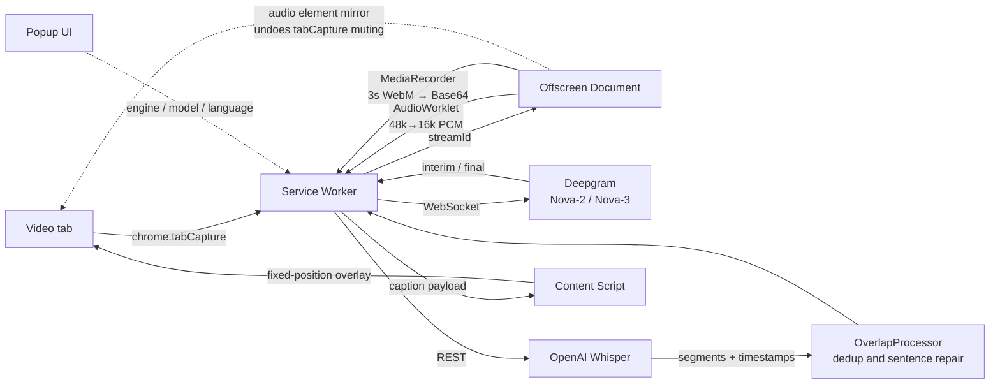

# Babel Bridge

[](https://opensource.org/licenses/MIT)
[](https://developer.chrome.com/docs/extensions/mv3/intro/)
[](https://developer.mozilla.org/docs/Web/JavaScript)

[中文](README.md)

A Chrome extension that generates live captions for any web video. Bring your own API key; no audio is stored anywhere.

> In the Babel story, language is what scattered people. This is an attempt at the opposite.

## Core Concept

Most videos online ship without captions, and the ones that do often aren't in a language you read. Deaf and hard-of-hearing viewers, language learners, anyone watching with the sound down in a noisy room — all stuck at the same wall.

Babel Bridge taps the tab's audio stream through `chrome.tabCapture`, pipes it to a speech recognition API, and paints the result back over the video. Nothing gets downloaded, nothing gets uploaded by hand, and it doesn't care which site you're on.

There are two pipelines, because on hosted APIs "fast" and "accurate" are not the same purchase:

| Engine | How it works | Best for |
|--------|--------------|----------|
| **Deepgram Streaming** | Persistent WebSocket, text appears as words are spoken | Live streams, meetings, conversation |
| **OpenAI Whisper** | 3-second batches, timestamps realigned afterward | Pre-recorded video, accuracy-critical work |

Both stay in the build. You pick one in the popup.

## Features

| Feature | Description |
|---------|-------------|
| **Two engines, one switch** | Deepgram streaming and Whisper batch recognition side by side |
| **Model and language control** | Nova-2 / Nova-3, 12 languages, plus `multi` auto-detection on Nova-3 |
| **Overlap dedup** | `OverlapProcessor` reconciles the repeated audio between batches; two-strategy matching, 15-25% of segments filtered |
| **Timeline correction** | Reads `video.currentTime` and works backward, so pausing never accumulates drift |
| **Encrypted key storage** | AES-256-GCM with PBKDF2-SHA256 (100k iterations), key derived from a browser fingerprint |
| **Your key, your account** | No middleman server — audio only ever reaches the API account you configured |

## Architecture



Both pipelines share the same Offscreen Document and Content Script. What differs is the audio format in the middle and how the API is called:

| Stage | Deepgram path | Whisper path |
|-------|---------------|--------------|
| Offscreen output | AudioWorklet Int16 PCM (20ms frames) | MediaRecorder WebM (3s timeslice) |
| Cross-context transfer | PCM frames | Base64 string |
| API | Long-lived WebSocket | REST, one chunk at a time |
| Post-processing | interim / final overwrite | OverlapProcessor dedup |

## Tech Stack

| Technology | Purpose | Notes |
|------------|---------|-------|
| Chrome Extension MV3 | Runtime | Service Worker + Offscreen Document |
| JavaScript ES6+ | Implementation | Zero runtime dependencies; ships as plain browser JS |
| Deepgram Nova-2 / Nova-3 | Live recognition | WebSocket streaming |
| OpenAI Whisper | Batch recognition | `verbose_json` for per-segment timestamps |
| AudioWorklet | Downsampling | 48kHz → 16kHz, off the main thread |
| MediaRecorder | Audio chunking | Replaced ScriptProcessorNode — see Design Decisions |
| Web Crypto API | Key encryption | AES-256-GCM + PBKDF2-SHA256 |
| Vite | Build | Multi-entry MV3 bundling |
| Vitest | Testing | Unit + integration; E2E (Playwright) not written yet |

## Quick Start

### Prerequisites

- Node.js ≥ 18, npm ≥ 9
- Chrome with Manifest V3 support
- An API key from either Deepgram or OpenAI

### Install

```bash
git clone https://github.com/tznthou/Babel_Bridge.git
cd Babel_Bridge

npm install
npm run build      # output lands in dist/
```

Use `npm run dev` while working — it watches for changes and rebuilds.

### Load into Chrome

1. Go to `chrome://extensions/`
2. Turn on "Developer mode" (top right)
3. Click "Load unpacked" and pick the `dist/` folder

Not on the Chrome Web Store yet, so developer mode is the only way in for now.

### Configure an API key

Keys go straight into the popup UI, get encrypted with AES-256-GCM, and live in `chrome.storage.local`. **There is no `.env` file, and no key should ever touch the source tree.**

**Deepgram** (the low-latency path): create a key at [Deepgram Console](https://console.deepgram.com/) with the Default role — it needs `usage:write`. Paste it into the Deepgram tab, then pick a model and language.

**OpenAI** (the high-accuracy path): grab a key from the [OpenAI Platform](https://platform.openai.com/api-keys) and paste it into the OpenAI tab. The extension calls `/v1/models` to confirm it works. All four formats are accepted: `sk-`, `sk-proj-`, `sk-admin-`, `sk-org-`.

### What it costs

| Engine | Rate | One hour of video |
|--------|------|-------------------|
| Deepgram Nova-2 | $0.0043 / min | ~$0.26 |
| Deepgram Nova-3 | $0.0077 / min | ~$0.46 |
| OpenAI Whisper | $0.006 / min | ~$0.36 |

Billed to your own API account. This project never touches payments.

### Using it

Open any page with a video → click the Babel Bridge icon → pick an engine → enable captions → grant audio capture.

## Technical Limitations

These are walls we hit in testing, not features waiting to be built:

| Limitation | Detail |
|------------|--------|
| **Mixed Chinese-English audio doesn't work** | With Deepgram on `zh-TW`, English comes back garbled; with `multi` auto-detection, Chinese disappears entirely (`multi` covers neither Chinese nor Korean) |
| **Nova-3 has no Chinese** | `zh-TW` / `zh` return HTTP 400, so Chinese has to run on Nova-2 |
| **Whisper path sits at 5-7 seconds** | 3s of buffering + 2-3s of API time + 0.5-1s of network. That's the floor for a hosted batch pipeline |
| **Deepgram's latency number is unverified** | Phase 2.3 observed roughly 2-3 seconds, but never separated time-to-first-character from time-to-final-text. Those two can differ a lot. The number needs a proper remeasure |
| **Developer mode required** | No Chrome Web Store listing yet |

## Project Structure

```
Babel Bridge/
├── src/
│   ├── background/         Service Worker controller, Deepgram WebSocket client,
│   │                       Whisper client, OverlapProcessor
│   ├── offscreen/          Audio capture, AudioWorklet PCM processing, mirror playback
│   ├── content/            Caption overlay and video time monitoring
│   ├── popup/              Control panel (dual API keys, model and language pickers)
│   └── lib/                Crypto, key managers, error handling, sentence rules, similarity
├── tests/                  unit (Vitest) · integration (needs API key) · e2e (not written)
├── docs/                   PRD · SPEC · DEVELOPMENT · MILESTONES · testing/ · archive/
├── scripts/                Build scripts + debug/ (DevTools Console diagnostics)
├── demo/                   Interactive OverlapProcessor demo page
├── README_EN.md            This file
└── README.md               Chinese version
```

## Development Status

Phase 2 is done — both engines work. Per-phase implementation notes, test data, and commit references live in [docs/MILESTONES.md](docs/MILESTONES.md).

| Phase | Window | Status |
|-------|--------|--------|
| Phase 0 — Foundation and key security | 2025-11-08 | ✅ |
| Phase 1 — Whisper pipeline and caption rendering | 2025-11-09 – 11-15 | ✅ |
| Phase 2 — Deepgram Streaming | 2025-11-16 – 12-02 | ✅ |
| Phase 3 — UI polish and translation | — | 🔲 |

```bash
npm test                 # unit + integration (integration skips itself without a key)
npm run test:unit
npm run test:integration # requires the DEEPGRAM_API_KEY environment variable
npm run lint
npm run typecheck        # JSDoc type checking (checkJs — not a TypeScript migration)
npm run package          # builds the store-ready .zip
```

## Reflections

### Design Decisions

**Killing ScriptProcessorNode**

The original audio path was `AudioContext` + `ScriptProcessorNode` + an MP3 encoder. It froze the browser — not the tab, the whole of Chrome.

Two days of digging turned up something uncomfortable: the bug wasn't in our code. `ScriptProcessorNode` has been deprecated for years, and pairing it with `tabCapture` inside an Offscreen Document trips a deadlock deep in Chrome. No amount of logging or parameter tweaking fixes that, because the mistake was the decision to use the API at all.

The whole path moved to `MediaRecorder`. A nice side effect: no more hand-rolled MP3 encoding. Whisper accepts WebM directly, and one LGPL dependency went away with it.

The habit that stuck: when something locks up at the system level, check whether the API has been deprecated before auditing your own lines.

**Base64 for audio, of all things**

Under Manifest V3, the Service Worker and the Offscreen Document can only talk through `chrome.runtime.sendMessage`, and its structured clone doesn't fully handle `Blob`. Send one across and it arrives damaged — silently, with no error to catch.

So audio goes `Blob → ArrayBuffer → Base64` on the way out and gets rebuilt on the way in. An ugly detour, but that's the MV3 we have.

**Keeping both engines**

Whisper came first. Only after it worked did the arithmetic sink in: 3 seconds of buffering, 2-3 seconds of API time, network on top. Five to seven seconds is the floor for a hosted batch pipeline, not a tuning problem. Fine for watching something pre-recorded, useless for a live stream.

Deepgram's streaming API is the right tool for live. But Whisper still wins on accuracy, and `OverlapProcessor` has no equivalent on the streaming side, so neither one got deleted.

### Lessons Learned

**Green tests aren't the same as working tests**

The reconnection test passed for months. It advanced the fake clock by 100ms against a reconnect delay of 1000ms — meaning you could delete the entire `connect()` body and the test stayed green.

It verified "calling this doesn't throw," not "reconnection happens." The question worth asking every time now: if I break the production code, does this test go red?

**Wiring up dead code can promote old bugs**

`startKeepAlive()` existed but was never called. Hooking it up revealed something worse: the leaked WebSocket connections had been quietly self-healing on Deepgram's 10-second idle timeout. With KeepAlive running, those same orphans stay alive indefinitely and keep burning quota.

Fixing one bug upgraded a batch of others from harmless to expensive. That kind of chain reaction never shows up in a changelog.

## Documentation

| Document | Contents |
|----------|----------|
| [docs/DEVELOPMENT.md](docs/DEVELOPMENT.md) | **Current architecture**, design decisions, debugging guide |
| [docs/MILESTONES.md](docs/MILESTONES.md) | Per-phase implementation notes, test data, known issues |
| [CHANGELOG.md](CHANGELOG.md) | Change log |
| [docs/testing/](docs/testing/) | Testing guides |
| [CLAUDE.md](CLAUDE.md) | AI pair-programming guide |
| [docs/SPEC.md](docs/SPEC.md) | ⚠️ Early system spec. Architecture changed in Phase 1/2 — kept for design rationale only |
| [docs/PRD.md](docs/PRD.md) | ⚠️ Early product requirements. Does not cover the dual-engine architecture |
| [docs/archive/](docs/archive/) | Development records, preserved as written |

## Contributing

Issues and PRs are both useful. When [opening an issue](https://github.com/tznthou/Babel_Bridge/issues), include your Chrome version, the site you were on, and the Console output.

Commits follow [Conventional Commits](https://www.conventionalcommits.org/): `feat` / `fix` / `docs` / `test` / `refactor` / `chore`.

## Acknowledgements

Approaches borrowed from:

| Project | License | What we learned from it |
|---------|---------|-------------------------|
| [videospeed](https://github.com/igrigorik/videospeed) | MIT | Video element positioning |
| [youtube.external.subtitle](https://github.com/siloor/youtube.external.subtitle) | MIT | Fullscreen handling |
| [JavascriptSubtitlesOctopus](https://github.com/libass/JavascriptSubtitlesOctopus) | MIT | Subtitle timeOffset mechanics |
| [netflix_subtitles_adder](https://github.com/chamika1/netflix_subtitles_adder) | MIT | `video.currentTime` synchronization |
| [MediaElement.js](https://github.com/mediaelement/mediaelement) | MIT | HTML5 media event handling |
| [WhisperJAV](https://github.com/meizhong986/WhisperJAV) | MIT | Subtitle dedup logic |
| [tokenx](https://github.com/johannschopplich/tokenx) | MIT | Chunking and overlap strategy |
| [Natural](https://github.com/NaturalNode/natural) | MIT | Levenshtein distance implementation |
| [DashPlayer](https://github.com/solidSpoon/DashPlayer) | AGPL-3.0 | Architectural ideas only, no code used |

## License

[MIT](LICENSE)

## Author

[@tznthou](https://github.com/tznthou)
