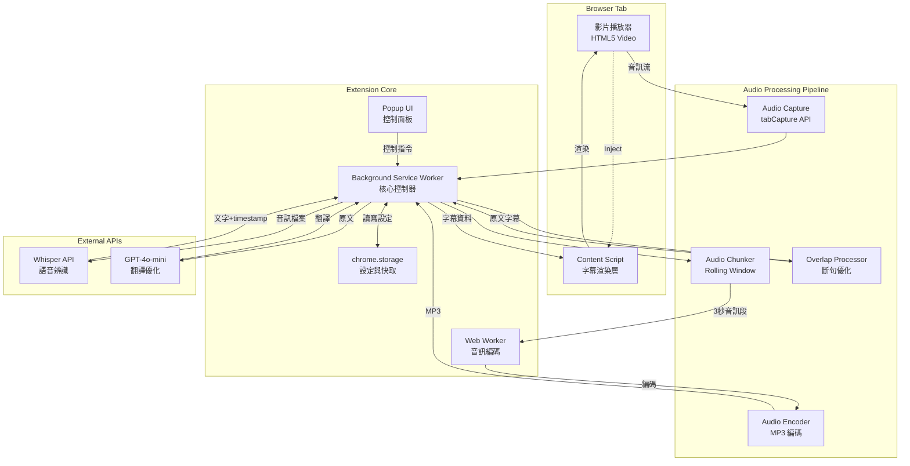

# 📘 SPEC (系統規格文件)
# Babel Bridge - 技術規格與實作標準

> 本文件為 **規格導向 (SPP) + 測試驅動 (TDD)** 標準模板,定義系統架構、API 規格、資料模型與開發規範。這是開發團隊與 AI 輔助編碼的「唯一真相來源」。

---

## 🧩 一、目的 (Purpose)

本文件旨在:
1. 定義 Babel Bridge 的技術架構與模組職責
2. 規範內部通訊協定與資料格式
3. 明確 OpenAI API 的呼叫方式與錯誤處理
4. 提供測試驅動開發 (TDD) 的規格基準
5. 確保前後端(Background/Content Script)契約一致性

**目標讀者**: 開發者、測試工程師、AI 編碼助手

---

## 🏗️ 二、系統架構 (Architecture Overview)



### 架構層次說明

| 層次 | 元件 | 職責 | 技術 |
|------|------|------|------|
| **展示層** | Content Script | 字幕 UI 渲染、樣式控制、影片事件監聽 | DOM 操作, CSS |
| **控制層** | Background Service Worker | 音訊流程編排、API 呼叫、狀態管理 | Service Worker API |
| **控制層** | Popup UI | 使用者設定介面、功能開關 | HTML + JS |
| **處理層** | Audio Processing Pipeline | 音訊擷取、切段、編碼、斷句優化 | Web Audio API, Web Worker |
| **服務層** | External APIs | 語音辨識、翻譯 | OpenAI API |
| **儲存層** | chrome.storage | 持久化設定、API Key、快取 | Chrome Storage API |

---

## 🧱 三、模組與責任劃分 (Modules & Responsibilities)

### 3.1 Background Service Worker

**檔案**: `src/background/service-worker.js`

**職責**:
- 作為 Extension 的核心控制器,協調所有模組
- 管理 chrome.tabCapture 的生命週期
- 編排音訊處理流程
- 呼叫 Whisper 與 GPT API
- 分發字幕資料給 Content Script
- 處理 Popup 控制指令

**輸入**:
- Popup 控制訊息 (啟用/停用、設定變更)
- Web Worker 編碼完成的音訊檔案
- Whisper API 辨識結果
- GPT API 翻譯結果

**輸出**:
- 字幕資料給 Content Script
- 狀態更新給 Popup
- API 請求給 OpenAI

---

### 3.2 Audio Capture Module

**檔案**: `src/background/audio-capture.js`

**職責**:
- 使用 `chrome.tabCapture.capture()` 擷取 tab 音訊流
- 建立 AudioContext 處理音訊
- 管理音訊流的開始與停止

**輸入**:
- Tab ID
- 啟用/停用指令

**輸出**:
- MediaStream 音訊流

**API 規格**:
```javascript
class AudioCapture {
  /**
   * 開始擷取指定 tab 的音訊
   * @param {number} tabId - Chrome Tab ID
   * @returns {Promise<MediaStream>}
   * @throws {Error} 如果權限被拒絕或 tab 無音訊
   */
  async startCapture(tabId)
  
  /**
   * 停止音訊擷取
   * @returns {void}
   */
  stopCapture()
  
  /**
   * 取得當前音訊流狀態
   * @returns {'idle'|'capturing'|'error'}
   */
  getStatus()
}
```

---

### 3.3 Audio Chunker Module

**檔案**: `src/background/audio-chunker.js`

**職責**:
- 實作 Rolling Window 策略
- 每 3 秒切一段音訊,前後重疊 1 秒
- 將音訊段傳送給 Web Worker 編碼

**輸入**:
- MediaStream 音訊流

**輸出**:
- AudioBuffer 音訊段 (包含 timestamp)

**配置參數**:
```javascript
const CHUNK_CONFIG = {
  chunkDuration: 3000,      // 每段 3 秒
  overlapDuration: 1000,    // 重疊 1 秒
  sampleRate: 16000,        // Whisper 建議 16kHz
  channels: 1               // 單聲道
}
```

**API 規格**:
```javascript
class AudioChunker {
  /**
   * 初始化 Chunker
   * @param {MediaStream} stream - 音訊流
   * @param {ChunkConfig} config - 配置參數
   */
  constructor(stream, config)
  
  /**
   * 開始切段處理
   * @param {Function} onChunk - 回調函數,接收 AudioBuffer
   */
  start(onChunk)
  
  /**
   * 停止切段
   */
  stop()
}
```

---

### 3.4 Audio Encoder Worker

**檔案**: `src/workers/audio-encoder.worker.js`

**職責**:
- 在 Web Worker 中進行音訊編碼
- 將 AudioBuffer 轉換為 MP3 格式
- 避免阻塞主執行緒

**輸入**:
- AudioBuffer (PCM 格式)

**輸出**:
- Blob (MP3 格式)

**通訊協定**:
```javascript
// 主執行緒 -> Worker
{
  type: 'encode',
  data: {
    audioBuffer: ArrayBuffer,
    sampleRate: 16000,
    channels: 1,
    chunkId: 'chunk_001',
    timestamp: 1234567890
  }
}

// Worker -> 主執行緒
{
  type: 'encoded',
  data: {
    blob: Blob,           // MP3 檔案
    chunkId: 'chunk_001',
    timestamp: 1234567890,
    size: 45678           // bytes
  }
}
```

---

### 3.5 Whisper Client Module

**檔案**: `src/background/whisper-client.js`

**職責**:
- 封裝 OpenAI Whisper API 呼叫
- 處理 API 錯誤與重試邏輯
- 解析 API 回應並提取 segments

**輸入**:
- MP3 音訊檔案 (Blob)
- 語言代碼 (可選)

**輸出**:
- 辨識結果 (文字 + timestamp)

**API 規格**:
```javascript
class WhisperClient {
  /**
   * 初始化客戶端
   * @param {string} apiKey - OpenAI API Key
   */
  constructor(apiKey)
  
  /**
   * 轉錄音訊
   * @param {Blob} audioBlob - MP3 音訊檔案
   * @param {Object} options - 選項
   * @param {string} options.language - 語言代碼 (如 'en', 'zh')
   * @param {boolean} options.timestamps - 是否返回 timestamp
   * @returns {Promise<WhisperResponse>}
   */
  async transcribe(audioBlob, options = {})
}
```

**Whisper API 請求格式**:
```http
POST https://api.openai.com/v1/audio/transcriptions
Content-Type: multipart/form-data

file: <audio.mp3>
model: whisper-1
language: en
response_format: verbose_json
timestamp_granularities: ["segment"]
```

**Whisper API 回應格式**:
```json
{
  "text": "Complete transcription text",
  "language": "en",
  "duration": 3.14,
  "segments": [
    {
      "id": 0,
      "start": 0.0,
      "end": 2.5,
      "text": "First sentence.",
      "tokens": [50364, 2618, 8174, 13],
      "temperature": 0.0,
      "avg_logprob": -0.3,
      "compression_ratio": 1.2,
      "no_speech_prob": 0.01
    },
    {
      "id": 1,
      "start": 2.5,
      "end": 5.0,
      "text": "Second sentence.",
      "tokens": [50514, 2711, 8174, 13],
      "temperature": 0.0,
      "avg_logprob": -0.25,
      "compression_ratio": 1.15,
      "no_speech_prob": 0.02
    }
  ]
}
```

---

### 3.6 Overlap Processor Module

**檔案**: `src/background/subtitle-processor.js`

**職責**:
- 比對相鄰音訊段的重疊區文字
- 合併破碎的句子
- 優化斷句點

**輸入**:
- 前一段辨識結果
- 當前段辨識結果

**輸出**:
- 去重與優化後的字幕段

**處理邏輯**:
```javascript
class OverlapProcessor {
  /**
   * 處理重疊區
   * @param {Segment[]} previousSegments - 前一段的 segments
   * @param {Segment[]} currentSegments - 當前段的 segments
   * @returns {Segment[]} 去重後的新 segments
   */
  process(previousSegments, currentSegments) {
    // 1. 找出重疊區 (時間戳重疊的部分)
    // 2. 比對文字相似度
    // 3. 如果相似度 > 80%,視為重複,跳過
    // 4. 如果不相似,保留兩者
    // 5. 檢查斷句是否完整,必要時合併
  }
}
```

**範例**:
```
前一段: "今天天氣很好" (0.0 - 3.0s)
當前段: "氣很好,我們去公園" (2.0 - 5.0s)
重疊區: "氣很好" (2.0 - 3.0s)

處理後:
- 保留: "今天天氣很好" (0.0 - 3.0s)
- 保留: "我們去公園" (3.0 - 5.0s)  ← 修正時間戳,去除重複
```

---

### 3.7 Translator Module

**檔案**: `src/background/translator.js`

**職責**:
- 呼叫 GPT-4o-mini 翻譯字幕
- 同時進行斷句優化
- 批次處理以節省 API 呼叫

**輸入**:
- 原文字幕文字
- 目標語言代碼

**輸出**:
- 翻譯後的文字

**API 規格**:
```javascript
class Translator {
  /**
   * 翻譯字幕
   * @param {string} text - 原文
   * @param {string} targetLang - 目標語言 (如 'zh-TW', 'ja', 'en')
   * @returns {Promise<string>} 翻譯結果
   */
  async translate(text, targetLang)
  
  /**
   * 批次翻譯 (優化 API 使用)
   * @param {string[]} texts - 多段原文
   * @param {string} targetLang - 目標語言
   * @returns {Promise<string[]>} 翻譯結果陣列
   */
  async batchTranslate(texts, targetLang)
}
```

**GPT API 請求格式**:
```http
POST https://api.openai.com/v1/chat/completions
Content-Type: application/json

{
  "model": "gpt-4o-mini",
  "messages": [
    {
      "role": "system",
      "content": "你是專業字幕翻譯專家。將字幕翻譯成{目標語言},保持簡潔,適合字幕顯示。優化斷句,確保每句不超過 40 字元。保留專業術語原文。"
    },
    {
      "role": "user",
      "content": "Today we're going to learn about React hooks."
    }
  ],
  "temperature": 0.3,
  "max_tokens": 150
}
```

**GPT API 回應格式**:
```json
{
  "id": "chatcmpl-xxx",
  "object": "chat.completion",
  "created": 1234567890,
  "model": "gpt-4o-mini",
  "choices": [
    {
      "index": 0,
      "message": {
        "role": "assistant",
        "content": "今天我們要學習 React Hooks。"
      },
      "finish_reason": "stop"
    }
  ],
  "usage": {
    "prompt_tokens": 45,
    "completion_tokens": 12,
    "total_tokens": 57
  }
}
```

---

### 3.8 Content Script Module

**檔案**: `src/content/injector.js`, `src/content/subtitle-overlay.js`

**職責**:
- 偵測頁面中的影片元素
- 注入字幕 Overlay UI
- 渲染字幕文字
- 監聽影片播放事件 (play, pause, seek)

**輸入**:
- Background 傳送的字幕資料
- 使用者樣式設定

**輸出**:
- 渲染在影片上的字幕 DOM

**API 規格**:
```javascript
class SubtitleOverlay {
  /**
   * 初始化字幕覆蓋層
   * @param {HTMLVideoElement} videoElement - 影片元素
   */
  constructor(videoElement)
  
  /**
   * 顯示字幕
   * @param {Subtitle} subtitle - 字幕資料
   */
  show(subtitle)
  
  /**
   * 隱藏字幕
   */
  hide()
  
  /**
   * 更新樣式
   * @param {StyleConfig} config - 樣式配置
   */
  updateStyle(config)
  
  /**
   * 監聽影片事件
   */
  attachVideoListeners()
}
```

**字幕資料格式**:
```javascript
interface Subtitle {
  id: string              // 唯一識別碼
  text: string            // 原文
  translation?: string    // 翻譯 (可選)
  startTime: number       // 開始時間 (秒)
  endTime: number         // 結束時間 (秒)
  chunkId: string         // 對應的音訊段 ID
}
```

**樣式配置格式**:
```javascript
interface StyleConfig {
  fontSize: number        // 字體大小 (px)
  fontColor: string       // 字體顏色 (hex)
  backgroundColor: string // 背景顏色 (hex)
  backgroundOpacity: number // 背景透明度 (0-1)
  position: 'top'|'bottom'  // 位置
  padding: number         // 內距 (px)
}
```

---

### 3.9 Popup UI Module

**檔案**: `src/popup/popup.html`, `src/popup/popup.js`

**職責**:
- 提供使用者控制介面
- 顯示當前狀態 (啟用/停用、延遲時間等)
- 管理 OpenAI API Key (輸入、驗證、儲存)
- 調整功能開關與樣式
- 顯示使用成本統計

**UI 元素**:
```html
<div class="popup-container">
  <!-- 首次使用引導 (未設定 API Key 時顯示) -->
  <div class="onboarding" id="onboarding-section">
    <h2>歡迎使用 Babel Bridge! 🌉</h2>
    <p>開始之前,你需要設定 OpenAI API Key</p>
    
    <div class="info-box">
      <h3>為什麼需要 API Key?</h3>
      <ul>
        <li>🔑 使用 OpenAI Whisper 進行高準確度語音辨識</li>
        <li>💰 成本透明: 約 $0.37/小時影片</li>
        <li>🔒 你的 Key 安全儲存在本地,不會上傳</li>
        <li>🆓 OpenAI 提供新帳號免費額度</li>
      </ul>
    </div>
    
    <a href="https://platform.openai.com/api-keys" target="_blank" class="btn-primary">
      取得 API Key →
    </a>
  </div>
  
  <!-- API Key 設定區 -->
  <div class="api-key-section">
    <h3>OpenAI API Key</h3>
    
    <!-- 未設定狀態 -->
    <div id="api-key-input-form">
      <input 
        type="password" 
        id="api-key-input" 
        placeholder="sk-..."
        pattern="sk-[A-Za-z0-9]{48}"
      >
      <span class="hint">格式: sk- 開頭,共 51 字元</span>
      <button id="save-api-key-btn" class="btn-primary">
        儲存並驗證
      </button>
      <div id="api-key-error" class="error-message" style="display:none;"></div>
    </div>
    
    <!-- 已設定狀態 -->
    <div id="api-key-status" style="display:none;">
      <div class="key-display">
        <span class="key-masked" id="masked-key">sk-...xyz</span>
        <button id="toggle-key-visibility" class="btn-icon" title="顯示/隱藏">
          <svg><!-- 眼睛圖示 --></svg>
        </button>
      </div>
      <div class="status-badge success">
        <svg><!-- 勾勾圖示 --></svg>
        API Key 已驗證
      </div>
      <button id="update-api-key-btn" class="btn-secondary">
        更新 API Key
      </button>
    </div>
  </div>
  
  <!-- 主控制區 (API Key 設定後才顯示) -->
  <div class="main-controls" id="main-controls" style="display:none;">
    <!-- 狀態顯示 -->
    <div class="status-section">
      <div class="status-indicator" id="status-indicator">
        <span class="dot dot-inactive"></span>
        <span id="status-text">字幕已停用</span>
      </div>
      <button id="toggle-subtitle-btn" class="btn-toggle">
        啟用字幕
      </button>
    </div>
    
    <!-- 成本統計 -->
    <div class="cost-section">
      <h4>本次會話</h4>
      <div class="stats">
        <div class="stat-item">
          <span class="stat-label">辨識時長</span>
          <span class="stat-value" id="duration">0 分鐘</span>
        </div>
        <div class="stat-item">
          <span class="stat-label">預估成本</span>
          <span class="stat-value" id="cost">$0.00</span>
        </div>
      </div>
      <a href="#" id="view-monthly-stats">查看每月統計 →</a>
    </div>
    
    <!-- 翻譯設定 -->
    <div class="translation-section">
      <label class="toggle-label">
        <input type="checkbox" id="enable-translation">
        <span>啟用翻譯</span>
      </label>
      
      <select id="target-language" disabled>
        <option value="zh-TW">繁體中文</option>
        <option value="zh-CN">簡體中文</option>
        <option value="en">English</option>
        <option value="ja">日本語</option>
        <option value="ko">한국어</option>
        <option value="es">Español</option>
        <option value="fr">Français</option>
        <option value="de">Deutsch</option>
        <!-- 更多語言 -->
      </select>
    </div>
    
    <!-- 字幕樣式 -->
    <div class="style-section collapsible">
      <button class="section-header" id="style-header">
        <span>字幕樣式</span>
        <svg class="chevron"><!-- 箭頭 --></svg>
      </button>
      
      <div class="section-content" id="style-content">
        <label>
          字體大小: <span id="font-size-value">20px</span>
          <input type="range" id="font-size" min="12" max="32" value="20">
        </label>
        
        <label>
          位置:
          <select id="subtitle-position">
            <option value="bottom">下方</option>
            <option value="top">上方</option>
          </select>
        </label>
        
        <label>
          背景透明度: <span id="opacity-value">70%</span>
          <input type="range" id="background-opacity" min="0" max="100" value="70">
        </label>
      </div>
    </div>
    
    <!-- 設定連結 -->
    <div class="footer-links">
      <a href="#" id="open-settings">進階設定</a>
      <a href="https://github.com/yourusername/babel-bridge" target="_blank">
        說明文件
      </a>
    </div>
  </div>
</div>
```

**JavaScript API**:
```javascript
class PopupController {
  constructor() {
    this.apiKeyManager = new APIKeyManager()
    this.init()
  }
  
  async init() {
    // 檢查 API Key 是否已設定
    const hasApiKey = await this.apiKeyManager.hasValidKey()
    
    if (hasApiKey) {
      this.showMainControls()
    } else {
      this.showOnboarding()
    }
    
    this.attachEventListeners()
  }
  
  /**
   * 顯示主控制介面
   */
  showMainControls() {
    document.getElementById('onboarding-section').style.display = 'none'
    document.getElementById('main-controls').style.display = 'block'
    document.getElementById('api-key-status').style.display = 'block'
    document.getElementById('api-key-input-form').style.display = 'none'
  }
  
  /**
   * 顯示新手引導
   */
  showOnboarding() {
    document.getElementById('onboarding-section').style.display = 'block'
    document.getElementById('main-controls').style.display = 'none'
  }
  
  /**
   * 驗證並儲存 API Key
   */
  async saveApiKey() {
    const input = document.getElementById('api-key-input')
    const apiKey = input.value.trim()
    const errorDiv = document.getElementById('api-key-error')
    
    // 格式驗證
    if (!apiKey.startsWith('sk-') || apiKey.length !== 51) {
      errorDiv.textContent = '❌ API Key 格式錯誤 (應為 sk- 開頭,共 51 字元)'
      errorDiv.style.display = 'block'
      return
    }
    
    // 顯示載入狀態
    const saveBtn = document.getElementById('save-api-key-btn')
    saveBtn.disabled = true
    saveBtn.textContent = '驗證中...'
    
    try {
      // 呼叫 Background 驗證 API Key
      const isValid = await this.apiKeyManager.verifyAndSave(apiKey)
      
      if (isValid) {
        // 驗證成功
        this.showMainControls()
        this.showNotification('✓ API Key 驗證成功!', 'success')
      } else {
        // 驗證失敗
        errorDiv.textContent = '❌ API Key 無效,請檢查後重試'
        errorDiv.style.display = 'block'
      }
    } catch (error) {
      errorDiv.textContent = `❌ 驗證失敗: ${error.message}`
      errorDiv.style.display = 'block'
    } finally {
      saveBtn.disabled = false
      saveBtn.textContent = '儲存並驗證'
    }
  }
  
  /**
   * 顯示遮罩的 API Key
   */
  displayMaskedKey(apiKey) {
    const prefix = apiKey.substring(0, 3)  // sk-
    const suffix = apiKey.substring(apiKey.length - 4)  // 最後4字元
    document.getElementById('masked-key').textContent = `${prefix}...${suffix}`
  }
  
  /**
   * 切換 API Key 可見性
   */
  toggleKeyVisibility() {
    const keyDisplay = document.getElementById('masked-key')
    const currentlyMasked = keyDisplay.dataset.masked === 'true'
    
    if (currentlyMasked) {
      // 顯示完整 Key
      this.apiKeyManager.getKey().then(key => {
        keyDisplay.textContent = key
        keyDisplay.dataset.masked = 'false'
        
        // 3秒後自動隱藏
        setTimeout(() => {
          this.displayMaskedKey(key)
          keyDisplay.dataset.masked = 'true'
        }, 3000)
      })
    }
  }
  
  /**
   * 更新成本顯示
   */
  updateCostDisplay(durationMinutes, cost) {
    document.getElementById('duration').textContent = `${durationMinutes} 分鐘`
    document.getElementById('cost').textContent = `$${cost.toFixed(3)}`
  }
}

// 初始化
document.addEventListener('DOMContentLoaded', () => {
  new PopupController()
})
```

---

### 3.10 Storage Manager Module

**檔案**: `src/lib/storage-manager.js`

**職責**:
- 封裝 `chrome.storage.local` API
- 管理使用者設定、API Key、快取

**API 規格**:
```javascript
class StorageManager {
  /**
   * 儲存設定
   * @param {string} key - 鍵名
   * @param {any} value - 值
   * @returns {Promise<void>}
   */
  async set(key, value)
  
  /**
   * 讀取設定
   * @param {string} key - 鍵名
   * @param {any} defaultValue - 預設值
   * @returns {Promise<any>}
   */
  async get(key, defaultValue = null)
  
  /**
   * 刪除設定
   * @param {string} key - 鍵名
   * @returns {Promise<void>}
   */
  async remove(key)
  
  /**
   * 清空所有設定
   * @returns {Promise<void>}
   */
  async clear()
}
```

**儲存的資料結構**:
```javascript
{
  // API 設定
  "apiKey": "sk-xxx",
  "apiKeyVerified": true,
  
  // 字幕設定
  "enableSubtitles": true,
  "enableTranslation": false,
  "targetLanguage": "zh-TW",
  
  // 樣式設定
  "style": {
    "fontSize": 20,
    "fontColor": "#FFFFFF",
    "backgroundColor": "#000000",
    "backgroundOpacity": 0.7,
    "position": "bottom",
    "padding": 10
  },
  
  // 快取 (可選)
  "cache": {
    "chunk_001": {
      "text": "Hello world",
      "translation": "你好世界"
    }
  }
}
```

---

### 3.11 API Key Manager Module

**檔案**: `src/lib/api-key-manager.js`

**職責**:
- 管理 OpenAI API Key 的儲存與讀取
- 驗證 API Key 有效性
- 提供 API Key 安全儲存
- 追蹤 API 使用量與成本

**API 規格**:
```javascript
class APIKeyManager {
  /**
   * 檢查是否已設定有效的 API Key
   * @returns {Promise<boolean>}
   */
  async hasValidKey()
  
  /**
   * 驗證並儲存 API Key
   * @param {string} apiKey - OpenAI API Key
   * @returns {Promise<boolean>} 驗證是否成功
   * @throws {Error} 如果網路錯誤或格式錯誤
   */
  async verifyAndSave(apiKey)
  
  /**
   * 取得儲存的 API Key
   * @returns {Promise<string|null>}
   */
  async getKey()
  
  /**
   * 刪除儲存的 API Key
   * @returns {Promise<void>}
   */
  async removeKey()
  
  /**
   * 驗證 API Key 格式
   * @param {string} apiKey
   * @returns {boolean}
   */
  validateKeyFormat(apiKey)
  
  /**
   * 記錄 API 使用量
   * @param {string} type - 'whisper' 或 'gpt'
   * @param {number} tokens - 使用的 token 數量
   * @param {number} durationSeconds - 音訊時長(秒)
   * @returns {Promise<void>}
   */
  async logUsage(type, tokens, durationSeconds)
  
  /**
   * 取得本月使用統計
   * @returns {Promise<UsageStats>}
   */
  async getMonthlyStats()
  
  /**
   * 計算預估成本
   * @param {number} whisperMinutes - Whisper 使用分鐘數
   * @param {number} gptTokens - GPT 使用 tokens
   * @returns {number} 成本(USD)
   */
  calculateCost(whisperMinutes, gptTokens)
}
```

**API Key 驗證流程**:
```javascript
async verifyAndSave(apiKey) {
  // 1. 格式驗證
  if (!this.validateKeyFormat(apiKey)) {
    throw new Error('API Key 格式錯誤')
  }
  
  // 2. 呼叫 OpenAI API 測試
  try {
    const response = await fetch('https://api.openai.com/v1/models', {
      headers: {
        'Authorization': `Bearer ${apiKey}`
      }
    })
    
    if (response.ok) {
      // 3. 驗證成功,儲存 Key
      await chrome.storage.local.set({
        'openai_api_key': apiKey,
        'api_key_verified': true,
        'api_key_verified_at': Date.now()
      })
      return true
    } else if (response.status === 401) {
      // 4. API Key 無效
      return false
    } else {
      throw new Error(`驗證失敗: ${response.statusText}`)
    }
  } catch (error) {
    throw new Error(`網路錯誤: ${error.message}`)
  }
}

validateKeyFormat(apiKey) {
  // OpenAI API Key 格式: sk- 開頭,共 51 字元
  const regex = /^sk-[A-Za-z0-9]{48}$/
  return regex.test(apiKey)
}

calculateCost(whisperMinutes, gptTokens) {
  // Whisper: $0.006 / 分鐘
  const whisperCost = whisperMinutes * 0.006
  
  // GPT-4o-mini: $0.15/1M input tokens, $0.6/1M output tokens
  // 假設 input:output = 1:1
  const gptCost = (gptTokens / 2) * (0.15 / 1000000) + 
                  (gptTokens / 2) * (0.6 / 1000000)
  
  return whisperCost + gptCost
}
```

**使用量追蹤資料結構**:
```javascript
interface UsageRecord {
  timestamp: number           // Unix timestamp
  type: 'whisper' | 'gpt'    // API 類型
  tokens?: number             // GPT tokens
  durationSeconds?: number    // Whisper 音訊時長
  cost: number                // 預估成本 (USD)
}

interface UsageStats {
  month: string               // YYYY-MM
  totalWhisperMinutes: number // Whisper 總時長(分鐘)
  totalGptTokens: number      // GPT 總 tokens
  totalCost: number           // 總成本(USD)
  dailyBreakdown: {           // 每日統計
    [date: string]: {
      whisperMinutes: number
      gptTokens: number
      cost: number
    }
  }
  records: UsageRecord[]      // 詳細記錄(最近 100 筆)
}
```

**儲存格式 (chrome.storage.local)**:
```javascript
{
  // API Key
  "openai_api_key": "sk-...",
  "api_key_verified": true,
  "api_key_verified_at": 1234567890,
  
  // 當前會話統計
  "current_session": {
    "startTime": 1234567890,
    "whisperMinutes": 5.2,
    "gptTokens": 1200,
    "cost": 0.032
  },
  
  // 每月使用量統計
  "usage_2025_01": {
    "month": "2025-01",
    "totalWhisperMinutes": 120,
    "totalGptTokens": 50000,
    "totalCost": 0.75,
    "dailyBreakdown": {
      "2025-01-15": {
        "whisperMinutes": 30,
        "gptTokens": 12000,
        "cost": 0.19
      }
    },
    "records": [...]
  },
  
  // 預算設定
  "monthly_budget": 10.0,        // USD
  "budget_alert_threshold": 0.8,  // 80%
  "budget_alert_enabled": true
}
```

**成本追蹤範例**:
```javascript
// 記錄 Whisper 使用
await apiKeyManager.logUsage('whisper', null, 180) // 3 分鐘音訊

// 記錄 GPT 使用
await apiKeyManager.logUsage('gpt', 500, null) // 500 tokens

// 取得統計
const stats = await apiKeyManager.getMonthlyStats()
console.log(`本月已使用 $${stats.totalCost.toFixed(2)}`)

// 檢查是否超過預算
if (stats.totalCost > monthlyBudget * 0.8) {
  showBudgetAlert()
}
```

---

## 🔗 四、通訊協定 (Communication Protocol)

### 4.1 Background ↔ Content Script

使用 `chrome.runtime.sendMessage()` 與 `chrome.tabs.sendMessage()`

**Message 格式**:
```javascript
interface Message {
  type: string            // 訊息類型
  data: any               // 訊息資料
  timestamp: number       // 時間戳記
  tabId?: number          // Tab ID (可選)
}
```

**訊息類型**:

| Type | 方向 | 說明 | Data |
|------|------|------|------|
| `SUBTITLE_UPDATE` | Background → Content | 新字幕產生 | `{ subtitle: Subtitle }` |
| `STYLE_UPDATE` | Background → Content | 樣式更新 | `{ style: StyleConfig }` |
| `ENABLE_SUBTITLES` | Popup → Background | 啟用字幕 | `{ tabId: number }` |
| `DISABLE_SUBTITLES` | Popup → Background | 停用字幕 | `{ tabId: number }` |
| `STATUS_REQUEST` | Popup → Background | 查詢狀態 | `{}` |
| `STATUS_RESPONSE` | Background → Popup | 回應狀態 | `{ status: string, delay: number }` |

**範例**:
```javascript
// Content Script 接收字幕
chrome.runtime.onMessage.addListener((message, sender, sendResponse) => {
  if (message.type === 'SUBTITLE_UPDATE') {
    const subtitle = message.data.subtitle
    subtitleOverlay.show(subtitle)
    sendResponse({ success: true })
  }
})

// Background 傳送字幕給 Content Script
chrome.tabs.sendMessage(tabId, {
  type: 'SUBTITLE_UPDATE',
  data: {
    subtitle: {
      id: 'sub_001',
      text: 'Hello world',
      translation: '你好世界',
      startTime: 0.0,
      endTime: 2.5,
      chunkId: 'chunk_001'
    }
  },
  timestamp: Date.now()
})
```

---

### 4.2 Popup ↔ Background

使用 `chrome.runtime.sendMessage()`

**範例**:
```javascript
// Popup 啟用字幕
document.getElementById('toggle-btn').addEventListener('click', async () => {
  const [tab] = await chrome.tabs.query({ active: true, currentWindow: true })
  
  chrome.runtime.sendMessage({
    type: 'ENABLE_SUBTITLES',
    data: { tabId: tab.id },
    timestamp: Date.now()
  }, (response) => {
    if (response.success) {
      updateStatus('字幕已啟用')
    } else {
      alert('啟用失敗: ' + response.error)
    }
  })
})
```

---

## ⚡ 五、錯誤處理 (Error Handling)

### 5.1 錯誤類型定義

```javascript
class BabelBridgeError extends Error {
  constructor(code, message, details = {}) {
    super(message)
    this.code = code
    this.details = details
    this.timestamp = Date.now()
  }
}
```

### 5.2 錯誤碼表

| 錯誤碼 | 說明 | 處理方式 |
|--------|------|----------|
| `API_KEY_NOT_SET` | 使用者尚未設定 API Key | 引導至設定頁面 |
| `API_KEY_INVALID` | API Key 無效或過期 | 提示重新輸入 API Key |
| `API_KEY_FORMAT_ERROR` | API Key 格式錯誤 | 顯示格式要求提示 |
| `API_KEY_VERIFICATION_FAILED` | API Key 驗證過程失敗 | 提示稍後重試或檢查網路 |
| `API_RATE_LIMIT` | API 呼叫超過限制 | 延遲重試,顯示等待訊息 |
| `API_NETWORK_ERROR` | 網路連線失敗 | 重試 3 次,失敗後提示 |
| `API_INSUFFICIENT_QUOTA` | OpenAI 帳戶額度不足 | 提示充值或檢查帳單 |
| `CAPTURE_PERMISSION_DENIED` | 使用者拒絕音訊擷取權限 | 顯示友善提示,引導授權 |
| `CAPTURE_NO_AUDIO` | Tab 中沒有音訊源 | 提示使用者播放影片 |
| `WHISPER_TRANSCRIPTION_FAILED` | 語音辨識失敗 | 記錄錯誤,跳過該音訊段 |
| `GPT_TRANSLATION_FAILED` | 翻譯失敗 | 僅顯示原文字幕 |
| `WORKER_ENCODING_FAILED` | 音訊編碼失敗 | 記錄錯誤,跳過該段 |
| `CONTENT_SCRIPT_NOT_LOADED` | Content Script 未載入 | 重新注入 Content Script |
| `STORAGE_QUOTA_EXCEEDED` | 儲存空間不足 | 清理舊的使用記錄或快取 |
| `BUDGET_EXCEEDED` | 超過使用者設定的預算 | 顯示警告,詢問是否繼續 |

### 5.3 錯誤處理流程

```javascript
// 統一錯誤處理器
class ErrorHandler {
  static handle(error) {
    console.error(`[Babel Bridge Error] ${error.code}:`, error.message, error.details)
    
    // 根據錯誤類型決定處理方式
    switch (error.code) {
      case 'API_RATE_LIMIT':
        return this.handleRateLimit(error)
      case 'API_NETWORK_ERROR':
        return this.handleNetworkError(error)
      default:
        return this.handleGenericError(error)
    }
  }
  
  static handleRateLimit(error) {
    // 等待後重試
    const retryAfter = error.details.retryAfter || 5000
    return new Promise(resolve => {
      setTimeout(() => resolve({ retry: true }), retryAfter)
    })
  }
  
  static handleNetworkError(error) {
    // 最多重試 3 次
    if (error.details.retryCount < 3) {
      return { retry: true }
    } else {
      this.notifyUser('網路連線失敗,請檢查網路設定')
      return { retry: false }
    }
  }
  
  static notifyUser(message) {
    // 透過 Popup 或 Notification 顯示錯誤
    chrome.notifications.create({
      type: 'basic',
      iconUrl: 'icon.png',
      title: 'Babel Bridge',
      message: message
    })
  }
}
```

---

## 🧪 六、測試策略 (Testing Strategy)

### 6.1 單元測試 (Unit Tests)

**目標**: 驗證每個模組的輸入/輸出行為

**工具**: Jest

**測試範例**:
```javascript
// tests/unit/overlap-processor.test.js
describe('OverlapProcessor', () => {
  test('should remove duplicate segments in overlap region', () => {
    const processor = new OverlapProcessor()
    
    const previous = [
      { id: 0, start: 0.0, end: 3.0, text: '今天天氣很好' }
    ]
    
    const current = [
      { id: 0, start: 2.0, end: 3.0, text: '氣很好' },
      { id: 1, start: 3.0, end: 5.0, text: '我們去公園' }
    ]
    
    const result = processor.process(previous, current)
    
    expect(result).toHaveLength(2)
    expect(result[0].text).toBe('今天天氣很好')
    expect(result[1].text).toBe('我們去公園')
  })
})
```

### 6.2 整合測試 (Integration Tests)

**目標**: 驗證模組間通訊與資料流

**測試範例**:
```javascript
// tests/integration/audio-pipeline.test.js
describe('Audio Processing Pipeline', () => {
  test('should process audio from capture to subtitle', async () => {
    // 1. 模擬音訊擷取
    const mockStream = createMockAudioStream()
    const capture = new AudioCapture()
    await capture.startCapture(1)
    
    // 2. 音訊切段
    const chunker = new AudioChunker(mockStream, CHUNK_CONFIG)
    const chunks = []
    chunker.start((chunk) => chunks.push(chunk))
    
    await wait(4000) // 等待產生音訊段
    
    // 3. 驗證
    expect(chunks.length).toBeGreaterThan(0)
    expect(chunks[0]).toHaveProperty('timestamp')
  })
})
```

### 6.3 端對端測試 (E2E Tests)

**目標**: 模擬真實使用場景

**工具**: Playwright

**測試範例**:
```javascript
// tests/e2e/subtitle-display.spec.js
const { test, expect } = require('@playwright/test')

test('should display subtitles on YouTube video', async ({ page, context }) => {
  // 1. 載入 Extension
  await context.addExtension('./dist')
  
  // 2. 前往 YouTube
  await page.goto('https://www.youtube.com/watch?v=dQw4w9WgXcQ')
  
  // 3. 啟用字幕
  await page.click('[data-testid="popup-toggle"]')
  
  // 4. 播放影片
  await page.click('.ytp-play-button')
  
  // 5. 等待字幕出現
  await page.waitForSelector('.babel-subtitle', { timeout: 10000 })
  
  // 6. 驗證字幕存在
  const subtitle = await page.textContent('.babel-subtitle')
  expect(subtitle).toBeTruthy()
  expect(subtitle.length).toBeGreaterThan(0)
})
```

### 6.4 測試覆蓋率目標

| 模組 | 目標覆蓋率 |
|------|-----------|
| Audio Processing | 80% |
| API Clients | 70% |
| Content Script | 60% |
| Popup UI | 50% |
| **整體** | **≥ 70%** |

---

## 🚀 七、部署與環境變數 (Deployment)

### 7.1 環境變數

**檔案**: `.env` (不提交到 Git)

```bash
# OpenAI API
VITE_OPENAI_API_KEY=sk-xxx

# 開發模式設定
VITE_DEV_MODE=true
VITE_LOG_LEVEL=debug

# API 端點 (可自訂)
VITE_WHISPER_API_URL=https://api.openai.com/v1/audio/transcriptions
VITE_GPT_API_URL=https://api.openai.com/v1/chat/completions
```

### 7.2 打包配置

**檔案**: `vite.config.js`

```javascript
import { defineConfig } from 'vite'
import { crx } from '@crxjs/vite-plugin'
import manifest from './manifest.json'

export default defineConfig({
  plugins: [crx({ manifest })],
  build: {
    rollupOptions: {
      input: {
        popup: 'src/popup/popup.html',
        background: 'src/background/service-worker.js',
        content: 'src/content/injector.js'
      }
    }
  }
})
```

### 7.3 Manifest V3 配置

**檔案**: `manifest.json`

```json
{
  "manifest_version": 3,
  "name": "Babel Bridge",
  "version": "0.1.0",
  "description": "AI-powered universal subtitles for web videos",
  "permissions": [
    "tabCapture",
    "activeTab",
    "storage",
    "scripting"
  ],
  "host_permissions": [
    "https://*/*"
  ],
  "background": {
    "service_worker": "src/background/service-worker.js"
  },
  "action": {
    "default_popup": "src/popup/popup.html",
    "default_icon": {
      "16": "icons/icon16.png",
      "48": "icons/icon48.png",
      "128": "icons/icon128.png"
    }
  },
  "content_scripts": [
    {
      "matches": ["<all_urls>"],
      "js": ["src/content/injector.js"],
      "css": ["src/content/styles.css"],
      "run_at": "document_idle"
    }
  ],
  "web_accessible_resources": [
    {
      "resources": ["icons/*"],
      "matches": ["<all_urls>"]
    }
  ]
}
```

---

## 🧩 八、開發準則 (Development Guidelines)

### 8.1 程式碼風格

- **語言**: TypeScript (優先) 或 JavaScript (ES6+)
- **Linting**: ESLint + Prettier
- **命名規範**:
  - 類別: PascalCase (`AudioCapture`)
  - 函數: camelCase (`startCapture`)
  - 常數: UPPER_SNAKE_CASE (`CHUNK_CONFIG`)
  - 檔案: kebab-case (`audio-capture.js`)

### 8.2 Commit 規範

遵循 Conventional Commits:

```bash
feat: add Whisper API integration
fix: resolve overlap detection bug
docs: update SPEC.md with new API
test: add unit tests for AudioChunker
refactor: simplify error handling logic
chore: update dependencies
```

### 8.3 模組設計原則

1. **單一職責**: 每個模組只負責一件事
2. **低耦合**: 模組間通過明確的介面通訊
3. **可測試性**: 所有模組可獨立測試
4. **錯誤處理**: 統一使用 `BabelBridgeError`
5. **文件完整**: 每個公開函數都有 JSDoc

---

## 📚 九、相關文件 (References)

- [`README.md`](../README.md) — 專案總覽與架構
- [`PRD.md`](./PRD.md) — 產品需求與使用者故事
- [OpenAI Whisper API](https://platform.openai.com/docs/guides/speech-to-text)
- [Chrome Extension 開發指南](https://developer.chrome.com/docs/extensions/)
- [Web Audio API](https://developer.mozilla.org/en-US/docs/Web/API/Web_Audio_API)

---

## 📝 附錄:完整 API 成本估算

### API 使用量估算

**假設場景**: 觀看 1 小時影片

1. **Whisper API**:
   - 1 小時 = 60 分鐘
   - 成本: 60 × $0.006 = **$0.36**

2. **GPT-4o-mini 翻譯**:
   - 1 小時約產生 120 段字幕 (每 30 秒一段)
   - 每段約 50 tokens (input) + 50 tokens (output) = 100 tokens
   - 總計: 120 × 100 = 12,000 tokens
   - Input 成本: (6,000 / 1,000,000) × $0.15 = $0.0009
   - Output 成本: (6,000 / 1,000,000) × $0.6 = $0.0036
   - 總成本: **$0.0045**

**總成本**: $0.36 + $0.0045 ≈ **$0.37 / 小時**

非常合理且可負擔!

---

**本文件為 Babel Bridge 的技術規格標準,所有開發工作應遵循此規範。**
